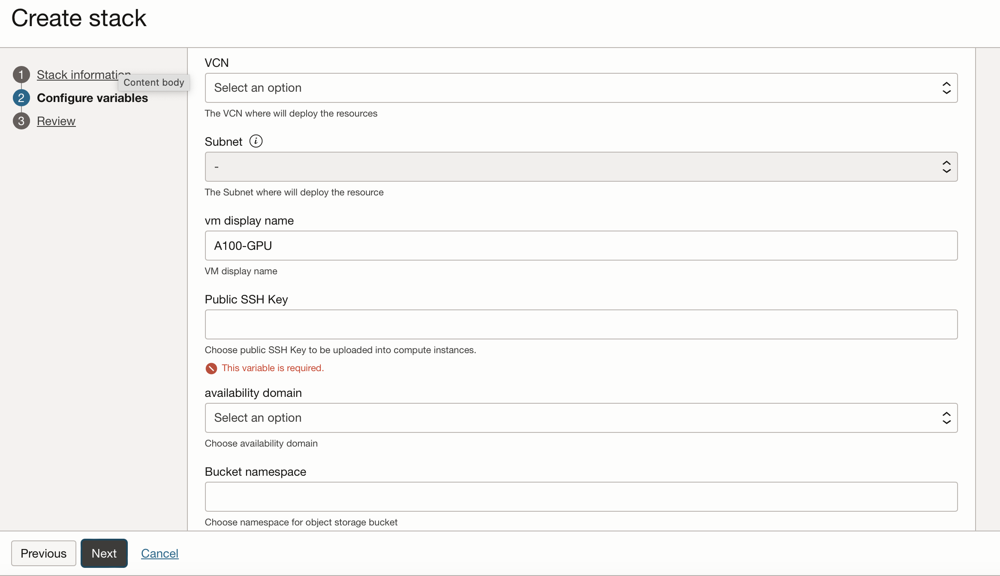
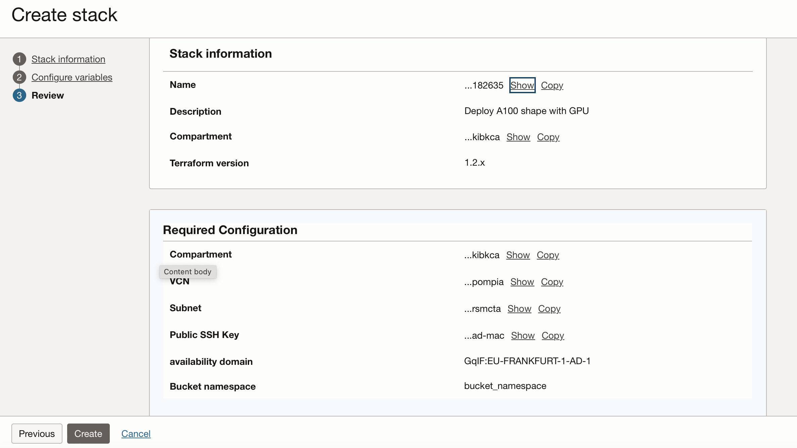

# Provision of resources to run JupyterHub Notebook

## Introduction

This lab will take you through the steps needed to provision the infrastructure using Resource manager and access Jupyter notebooks.

Estimated Time: 30 minutes

### Objectives

Provisioning of infrastructure using Resource manager.

### Prerequisites

This lab assumes you have:

* An Oracle Cloud account
* Administrator permissions or permissions to use the OCI Compute and Identity Domains
* Access to A10 or GPU shape, Usage of the Terraform code for one click deployment.

## Task 1: Provision resources

1. Go to Resource manager -> Stacks -> Create Stack. Choose My configuration and upload the provided zip file and click Next: [orm_stack_a100_credit_risk_assesment.zip](https://objectstorage.us-ashburn-1.oraclecloud.com/p/a0d6AI719MJQGAqApz2s_bKuWFggL7C9kyFng90Ezf65rXOeQ8I-Nbayvd5bDLSO/n/c4u02/b/hosted_workshops/o/orm_stack_a100_credit_risk_assesment.zip)

    

    Or you could use a single click deployment button shown below

    [](https://cloud.oracle.com/resourcemanager/stacks/create?zipUrl=https://objectstorage.us-ashburn-1.oraclecloud.com/p/a0d6AI719MJQGAqApz2s_bKuWFggL7C9kyFng90Ezf65rXOeQ8I-Nbayvd5bDLSO/n/c4u02/b/hosted_workshops/o/orm_stack_a100_credit_risk_assesment.zip)

2. Provide the information for **Compartment**, **VCN (Any suitable name)**, **Subnet**, **VM Display Name(Any suitable name)**

3. Provide your SSH Key to access the instance. Fill AD and bucket_namespace (Your tenancy namespace) information to create an object storage bucket needed in the next lab as shown below in the image.

    

4. Click Next and then select Run Apply and finally click on Create as shown below.

    

5. Wait for the Job to succeed. It may take 5-10 minutes for it to be successful and before infrastructure is provisioned.

## Task 2: Access the notebooks

1. Once the instance is created, wait for the cloud init completion and then you will be able to launch the jupyter notebook interface.

2. Go to security list of your subnet and give access to port 8888.

3. Copy the Public IP of the instance and ssh into the instance using Terminal.

4. Run the following command from /home/opc

    ```text
        <copy>
        nohup jupyter notebook --ip=0.0.0.0 --port=8888 > /home/opc/jupyter.log 2>&1 &
        </copy>
    ```

    Finally run *cat jupyter.log* and get the access token and make the following URL to access jupyter notebooks where VMPUBIP would be public IP of your instance.

    [https://VMPUBIP:8888/tree?token=XXXXXXXXXXXXXXXXX](https://VMPUBIP:8888/tree?token=XXXXXXXXXXXXXXXXX)

Once the deployment is successful, user can connect to Jupyter Notebook and review the step by step analysis. We use the widely available public U.S. Fannie Mae mortgage dataset to show an XGBoost classifer for predicting loan delinquencies.

You may now proceed to the next lab.

## Acknowledgements

**Authors**

* **Cristian Vlad**, Principal Cloud Architect, NACIE
* **Abhinav Jain**, Senior Cloud Engineer, NACIE