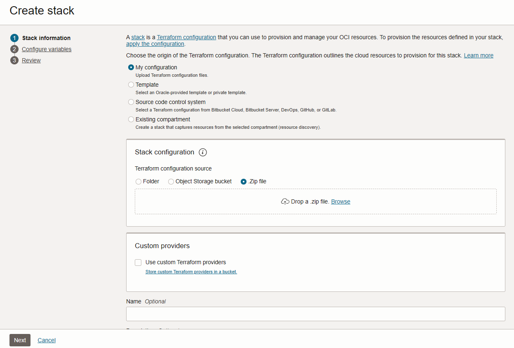
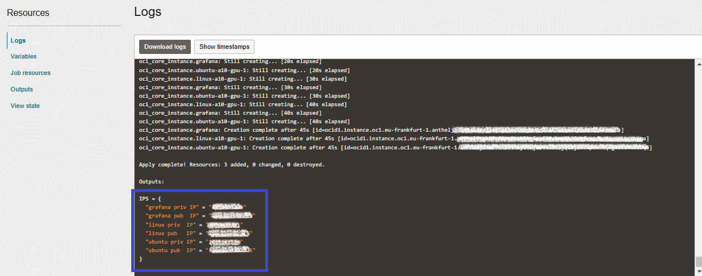
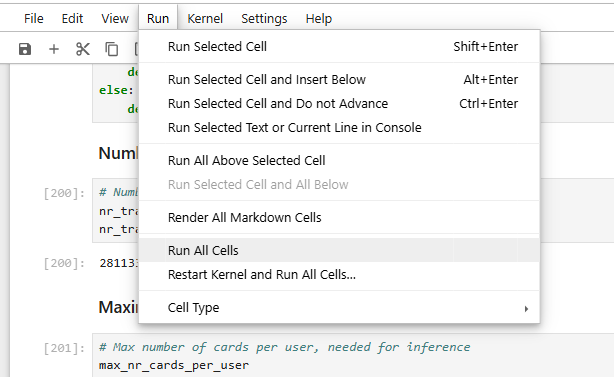

# Deploy VM infrastructure (GPU shape),  Grafana and Prometheus

## Introduction

In this lab, you will deploy the foundational infrastructure required for GPU performance monitoring using Oracle Resource Manager (ORM). The ORM stack will provision two A10 GPU-enabled virtual machines (one with Oracle Linux and one with Ubuntu) in a public subnet for generating and monitoring GPU activity. Additionally, a separate VM will be deployed to host Prometheus and Grafana. While the ORM stack sets up the infrastructure, Prometheus and Grafana will be installed and configured manually in later steps. This lab lays the groundwork for the subsequent stages of the workshop, where GPU activity and metrics will be monitored and visualized.

Estimated Time: 30 minutes

### Objectives

* Provision infrastructure using ORM to deploy two A10 GPU-enabled virtual machines (Oracle Linux and Ubuntu) and a separate VM for Prometheus and Grafana.
* Manually install Prometheus on the designated VM.
* Manually install Grafana on the designated VM.

### Prerequisites

This lab assumes you have:

* An Oracle Cloud account
* Administrator permissions or sufficient permissions to use OCI Compute and Networking services.
* Access to A10 GPU-enabled shapes, specifically the VM.GPU.A10.1 shape
* Access to the Oracle Resource Manager(ORM).

## Task 1: Ensure Networking Prerequisites

Before deploying the infrastructure, ensure the following networking prerequisites are met to allow proper functionality of the lab:

1. **Existing VCN and Public Subnet**:

    The ORM stack requires an existing VCN with a public subnet. The public subnet simplifies access to:
    * The Grafana dashboard from your laptop.
    * The Prometheus dashboard from your laptop.
    * Running the Ansible playbook from your laptop or server.
    
    **Note** - The ORM stack will deploy two VM.GPU.A10.1 instances. To save costs, ensure to stop or destroy them after completing the lab.

2. **Subnet Requirements**:

    The subnet must be public and associated with:
    * A Route Table containing an Internet Gateway to enable outbound Internet access.
    
    **Note** - The ORM stack includes a validation step that will test the subnet and raise an error if it is not public.

3. **Security rules**:

    The public subnet must have the following security rules configured:
    * Allow ingress for TCP/22 from your laptop or server to SSH into the VMs and for Ansible to work.
    * Allow ingress for TCP/3000 from your laptop or server to access the Grafana dashboard.
    * Allow ingress for TCP/9090 from your laptop or server to access the Prometheus dashboard.
    * Allow ingress/egress for TCP/9400 and TCP/9100 within the subnet where the VMs are created (for DCGM and Node Exporter).

Ensure these configurations are in place before proceeding to deploy the ORM stack.

## Task 2: Provision GPUs and Standard VM with the ORM Stack

To deploy the infrastructure for this lab, you will create and configure a stack in Oracle Resource Manager (ORM) to automate the provisioning of GPU-enabled and standard virtual machines.

1. **Create the ORM stack**
    
    * Navigate to the Resource Manager section in the Oracle Cloud Console:  _Developer Services_ -> _Resource manager_ -> _Stacks_ -> _Create Stack_.
    * Choose _My configuration_, upload this [infrastructure automation stack](???) and click **Next**.

            

    OR

    * You can use the single click deployment button below to launch the stack creation directly, accept the terms and click **Next**.

        [](https://cloud.oracle.com/resourcemanager/stacks/create?zipUrl=???)

2. Choose or fill in the deployment options, including:

    * **Compartment**, **Availability domain**, **VCN**, **Public Subnet**, **Public SSH Key**

        

    * Click **Next**.

3. Create and run the stack:
    
    * Review the options selected in the previous steps and then select _Run Apply_ and finally click on **Create** as shown below.

        

4. Wait for the job to complete, which should only take a few minutes. 
    
    * Once the stack creation is complete, you will have 3 new VMs:
        * **demo_linux_1**: to be monitored with DCGM
        * **demo_ubuntu_1**: to be monitored with DCGM
        * **demo_grafana**: will host the monitoring tools, Prometheus and Grafana.
    
    * The IP addresses of these instances will be displayed in both the stack output and the stack log.
    
       


## Task 3: Install Prometheus

Follow these steps to install Prometheus on the **demo_grafana** VM:

1. Connect to the `demo_grafana` VM:

* In your local terminal, use the SSH private key corresponding to the public key provided during the ORM stack deployment to connect to the demo_grafana VM. Replace <public-ip> with the public IP of the VM:

    ```
    <copy>
    ssh -i <path-to-your-ssh-private-key> opc@<public-ip>
    </copy>
    ```

2. Download and extract Prometheus:

    ```
    <copy>
    wget https://github.com/prometheus/prometheus/releases/download/v2.37.6/prometheus-2.37.6.linux-amd64.tar.gz
    tar xvfz prometheus-*.tar.gz
    </copy>
    ```
3. Create required directories:

* Create two directories for Prometheus:

    * `/etc/prometheus`: To store Prometheus configuration files.
    * `/var/lib/prometheus`: To hold application data.

    ```
    <copy>
    sudo mkdir /etc/prometheus /var/lib/prometheus
    </copy>
    ```
4. Navigate to the extracted folder:

    ```
    <copy>
    cd prometheus-2.37.6.linux-amd64
    </copy>
    ```

5. Move executables:

* Move the `prometheus` and `promtool` binaries to `/usr/local/bin` to make Prometheus accessible globally, to all users:

    ```
    <copy>
    sudo mv prometheus promtool /usr/local/bin/
    </copy>
    ```

6. Move configuration file:

* Move the `prometheus.yml` configuration file to `/etc/prometheus`:

    ```
    <copy>
    sudo mv prometheus.yml /etc/prometheus/prometheus.yml
    </copy>
    ```

7. Move console resources:

* Move the `consoles` and `console_libraries` directories to `/etc/prometheus`. These contain resources for creating custom consoles (not covered in this guide):

    ```
    <copy>
    sudo mv consoles/ console_libraries/ /etc/prometheus/
    </copy>
    ```

8. Verify installation:

* Check the Prometheus version to confirm the installation:

    ```
    <copy>
    prometheus --version
    </copy>
    ```

## Task 4: Configure Prometheus as a Service

Perform the below steps connected to the `demo_grafana` VM:

1. Create a `prometheus` user:

* Add a system user for Prometheus to run as a service:

    ```
    <copy>
    sudo useradd -rs /bin/false prometheus
    </copy>
    ```

2. Assign ownership of directories:

* Grant the `prometheus` user ownership of the directories created earlier:

    ```
    <copy>
    sudo chown -R prometheus: /etc/prometheus /var/lib/prometheus
    </copy>
    ```

3. Create a systemd service file:

* Configure Prometheus to run as a systemd service by creating a service file:

    ```
    <copy>
    sudo vi /etc/systemd/system/prometheus.service
    </copy>
    ```

    Add the following content to the file:

    ```
    <copy>
    [Unit]
    Description=Prometheus
    Wants=network-online.target
    After=network-online.target

    [Service]
    User=prometheus
    Group=prometheus
    Type=simple
    Restart=on-failure
    RestartSec=5s
    ExecStart=/usr/local/bin/prometheus \
        --config.file /etc/prometheus/prometheus.yml \
        --storage.tsdb.path /var/lib/prometheus/ \
        --web.console.templates=/etc/prometheus/consoles \
        --web.console.libraries=/etc/prometheus/console_libraries \
        --web.listen-address=0.0.0.0:9090 \
        --web.enable-lifecycle \
        --log.level=info

    [Install]
    WantedBy=multi-user.target
    </copy>
    ```

4. Enable and start the service:

* Reload the systemd daemon, enable the Prometheus service, and start it:

    ```
    <copy>
    sudo systemctl daemon-reload
    sudo systemctl enable prometheus
    sudo systemctl start prometheus
    </copy>
    ```

5. Check service status:

* Verify that Prometheus is running:

    ```
    <copy>
    sudo systemctl status prometheus
    </copy>
    ```

6. Open port 9090 in the firewall:

* Allow access to the Prometheus dashboard by opening port 9090:

    ```
    <copy>
    sudo systemctl stop firewalld
    sudo firewall-offline-cmd --zone=public --add-port=9090/tcp
    sudo systemctl start firewalld
    </copy>
    ```

7. Access Prometheus dashboard:

* Open your browser and navigate to:

    ```
    <copy>
    http://<public-ip>:9090
    </copy>
    ```
    Replace `<public-ip>` with the public IP address of the Prometheus server.


## Task 5: Install Grafana


------------------------------------------

## Task 2: Access the oke cluster via operator

1. After the stack is created, wait for the process to complete. Once finished, it will provide the necessary details to access the OKE cluster through the operator and bastion host, provided you selected this option in Task 1, point 2.

2. The stack's output will include the following details:

   * **Bastion**: The external IP address of the created bastion host.
   * **Operator**: The private IP address of the operator host.
   *  **SSH Tunnel Command**: Instructions on how to connect to the operator host via an SSH tunnel:
   ```
   <copy>
   ssh -o ProxyCommand='ssh -W %h:%p opc@<bastion_Public_IP>' opc@<operator_Private_IP>
   </copy>
   ```

3. Copy the `ssh_to_operator` command and execute in Terminal.

## Task 3: Access the OKE cluster and Morpheus pod

1. After running the _ssh_to_operator_ command in a terminal, you will be connected to the operator VM. This VM is equipped with all the necessary utilities to access the OKE cluster and execute kubectl commands.

    Run the below command to check the status and configuration of the OKE cluster once connected to the operator:

    ```
    <copy>
    k get all -A
    </copy>
    ```

    This command helps you verify if the pods and services have been successfully created and ensures there are no errors. Additionally, you can retrieve the Load Balancer's public IP address to use for testing the model query.

    

2. You can also collect the Load Balancer Public IP using the below command:
    
    ```
    <copy>
    kubectl get service fraud-detection-app -o jsonpath='{.status.loadBalancer.ingress[0].ip}'
    </copy>
    ```

3. Access Jupyter notebooks

    Use the Load Balancer public IP address, port 8888, and the authentication token found in the _fraud-detection-app*_ pod log file to access the Jupyter notebooks that will allow you to test running models against Morpheus on OKE.

    ```
    <copy>
    k logs fraud-detection-app-...
    </copy>
    ```
    
    and look for a value like this: **http://hostname:8888/tree?token=....**

    Replace "localhost" or "127.0.0.1" with the public IP address of the LoadBalancer, and paste the updated link into your browser to access the Jupyter Notebooks directly.

    

    Browse the _notebooks_ directory to view all the available notebooks.


## Task 4: Run TabFormer Jupyter notebooks in the Morpheus AI workflow for fraud detection

### Steps for Executing TabFormer Notebooks

1. **Preprocessing: `preprocess_Tabformer.ipynb`**  

    Run this notebook to preprocess the data - run cells one by one by pressing _Shift+Enter_, or select from the menu _Run_ -> _Run All Cells_.

    
    
    Outputs:
    * Files saved under `./data/TabFormer/gnn` and `./data/TabFormer/xgb`.
    * Preprocessor pipeline saved as `preprocessor.pkl`.
    * Variables saved in `variables.json` under `./data/TabFormer`.


2. **Training: `train_gnn_based_xgboost.ipynb`**
    
    **Important**: Before running, ensure Cell 2 has the value: `DATASET = TABFORMER`.

    Run the notebook cells to train the GNN-based XGBoost model.  

    **Outputs**:

    * Model files saved in `./data/TabFormer/models`. 

    * There is also an output at the end of the notebook:


3. **Inference: `inference_gnn_based_xgboost_TabFormer.ipynb`**  
    
    Use this notebook to perform inference on unseen data.  
    
    **Important**: 
    * In Cell 2, set: `dataset_base_path = '../data/TabFormer/'`.  
    * In Cell 13, ensure the TabFormer-specific selection is uncommented.

    Run the notebook.

**Optional: Pure XGBoost**  

For building and inferring with a pure XGBoost model (without GNN):  
    
4. **Training**: `train_xgboost.ipynb`

    Produces an XGBoost model in `./data/TabFormer/models`.  

    **Important**: In Cell 2, set: `DATASET = TABFORMER`.

    Run the notebook. 
    
5. **Inference**: `inference_xgboost_TabFormer.ipynb`

    Use this notebook for inference with the pure XGBoost model.

    Run the notebook.


## Task 5: Run Sparkov Jupyter notebooks in the Morpheus AI Workflow for fraud analysis

### Steps for Executing Sparkov Notebooks

1. **Preprocessing: `preprocess_Sparkov.ipynb`**  

    Run this notebook to preprocess the Sparkov dataset - run cells one by one by pressing _Shift+Enter_, or select from the menu _Run_ -> _Run All Cells_.  
   
    **Outputs**:

    * Files saved under `./data/Sparkov/gnn` and `./data/Sparkov/xgb`.
    * Preprocessor pipeline saved as `preprocessor.pkl`.
    * Variables saved in `variables.json` under `./data/Sparkov`.

2. **Training: `train_gnn_based_xgboost.ipynb`**  
   
    Train the GNN-based XGBoost model for Sparkov.  

    **Important**: Before running, ensure Cell 2 has the value: `DATASET = SPARKOV`.

    Run the notebook.

    **Outputs**:

    * Model files saved in `./data/Sparkov/models`.  

**Optional: Pure XGBoost**  

For building and inferring with a pure XGBoost model (without GNN):  
    
3. **Training**: `train_xgboost.ipynb`

    Produces an XGBoost model in `./data/Sparkov/models`.  
    
    **Important**: In Cell 2, set: `DATASET = SPARKOV`.  

    Run the notebook.

4. **Inference**: `inference_xgboost_Sparkov.ipynb`

    Use this notebook for inference with the pure XGBoost model.  
    
    **Important**:
    * In Cell 2, set: `dataset_base_path = '../data/Sparkov/'`.  
    * In Cell 13, ensure the Sparkov-specific content is uncommented.

    Run the notebook.


## Acknowledgements

**Authors** 
* Adina Nicolescu, Senior Cloud Engineer, NACIE
* Francisc Vass, Principal Cloud Architect, NACIE

**Last Updated By/Date**
* Adina Nicolescu - Senior Cloud Engineer, NACIE - Dec 2024
