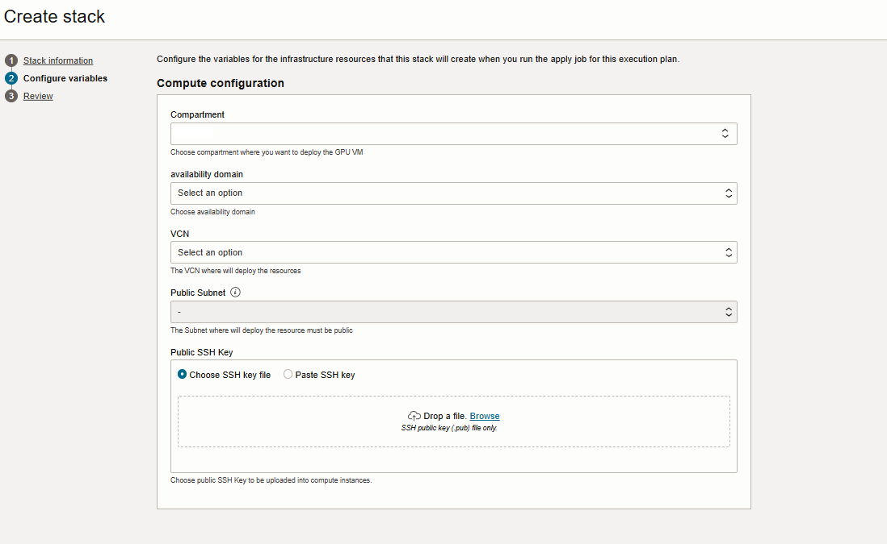
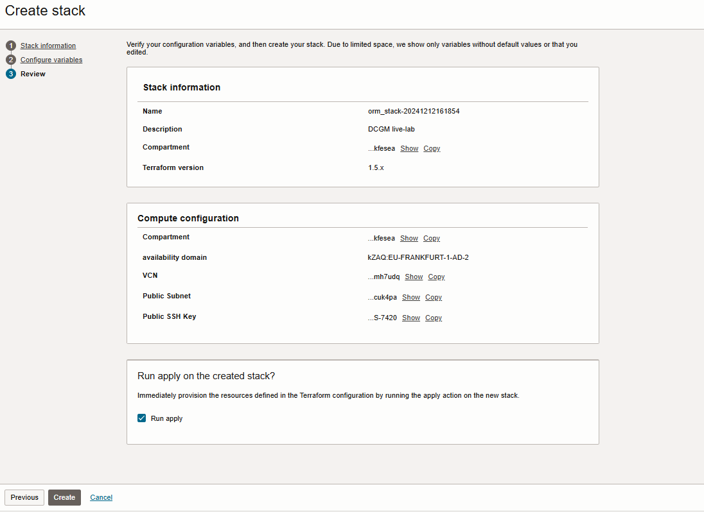

# Deploy VM infrastructure (GPU shape); install & configure Prometheus and Grafana

## Introduction

In this lab, you will deploy the foundational infrastructure required for GPU performance monitoring using Oracle Resource Manager (ORM). The ORM stack will provision two A10 GPU-enabled virtual machines (one with Oracle Linux and one with Ubuntu) in a public subnet for generating and monitoring GPU activity. Additionally, a separate VM will be deployed to host Prometheus and Grafana. While the ORM stack sets up the infrastructure, Prometheus and Grafana will be installed and configured manually in later steps. This lab lays the groundwork for the subsequent stages of the workshop, where GPU activity and metrics will be monitored and visualized.

Estimated Time: 20 minutes

### Objectives

* Ensure prerequisites are met from Networking point of view.
* Provision infrastructure using ORM to deploy two A10 GPU-enabled virtual machines (Oracle Linux and Ubuntu) and a separate VM for Prometheus and Grafana.

### Prerequisites

This lab assumes you have:

* An Oracle Cloud account
* Administrator permissions or sufficient permissions to use OCI Compute and Networking services.
* Access to A10 GPU-enabled shapes, specifically the VM.GPU.A10.1 shape
* Access to the Oracle Resource Manager(ORM).

## Task 1: Ensure Networking Prerequisites

Before deploying the infrastructure, ensure the following networking prerequisites are met to allow proper functionality of the lab:

1. **Existing VCN and Public Subnet**:

    The ORM stack requires an existing VCN with a public subnet. The public subnet simplifies access to:
    * The Grafana dashboard from your laptop.
    * The Prometheus dashboard from your laptop.s

2. **Subnet Requirements**:

    The subnet must be public and associated with:
    * A Route Table containing an Internet Gateway to enable outbound Internet access.
    
    **Note** - The ORM stack includes a validation step that will test the subnet and raise an error if it is not public.

3. **Security rules**:

    The public subnet must have the following security rules configured:
    * Allow ingress for TCP/22 from your laptop or server to SSH into the VMs and for Ansible to work.
    * Allow ingress for TCP/3000 from your laptop or server to access the Grafana dashboard.
    * Allow ingress for TCP/9090 from your laptop or server to access the Prometheus dashboard.
    * Allow ingress/egress for TCP/9400 and TCP/9100 within the subnet where the VMs are created (for DCGM and Node Exporter).

    As an alternative, for this test, you can open the security list completely: `0.0.0.0/0`.

Ensure these configurations are in place before proceeding to deploy the ORM stack.

## Task 2: Provision GPUs and Standard VM with the ORM Stack

To deploy the infrastructure for this lab, you will create and configure a stack in Oracle Resource Manager (ORM) to automate the provisioning of GPU-enabled and standard virtual machines.

1. **Create the ORM stack**
    
    * Navigate to the Resource Manager section in the Oracle Cloud Console:  _Developer Services_ -> _Resource manager_ -> _Stacks_ -> _Create Stack_.
    * Choose _My configuration_, upload this [infrastructure automation stack](???) and click **Next**.

        

    OR

    * You can use the single click deployment button below to launch the stack creation directly, accept the terms and click **Next**.

        

2. Choose or fill in the deployment options, including:

    * **Compartment**, **Availability domain**, **VCN**, **Public Subnet**, **Public SSH Key**

        

    * Click **Next**.

3. Create and run the stack:
    
    * Review the options selected in the previous steps and then select _Run Apply_ and finally click on **Create** as shown below.

        

4. Wait for the job to complete, which should only take a few minutes. 
    
    * Once the stack creation is complete, you will have 3 new VMs:
        * **demo_linux_1**: to be monitored with DCGM
        * **demo_ubuntu_1**: to be monitored with DCGM
        * **demo_grafana**: will host the monitoring tools, Prometheus and Grafana.
    
    * The IP addresses of these instances will be displayed in both the stack output and the stack log.
    
       

    * **Note** - The ORM stack will deploy two VM.GPU.A10.1 instances. To save costs, ensure to stop or destroy them after completing the lab.

You may now proceed to the next lab.

## Acknowledgements

**Authors** 
* Adina Nicolescu, Senior Cloud Engineer, NACIE
* Francisc Vass, Principal Cloud Architect, NACIE

**Last Updated By/Date**
* Adina Nicolescu - Senior Cloud Engineer, NACIE - Dec 2024
