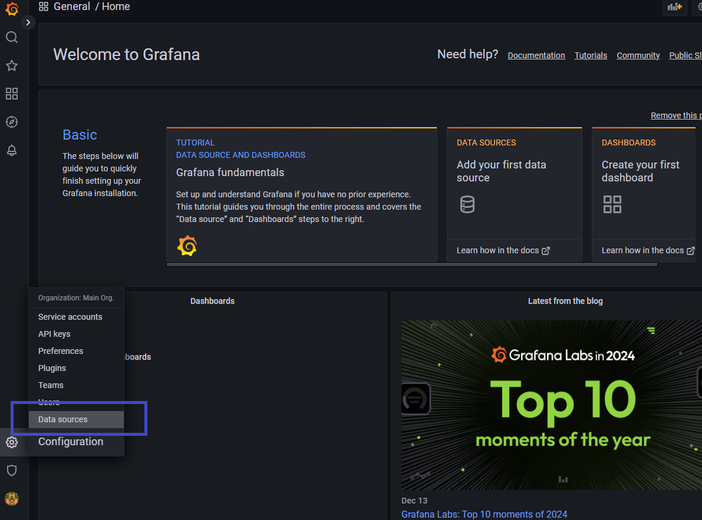

# Install & configure Prometheus and Grafana

## Introduction

In this lab, you will install Prometheus and Grafana on the separate VM deployed previously.

Estimated Time: 30 minutes

### Objectives

* Acces Linux VM previously deployed.
* Manually install Prometheus on the designated VM.
* Manually install Grafana on the designated VM.

### Prerequisites

This lab assumes you have:

* An Oracle Cloud account
* Administrator permissions or sufficient permissions to use OCI Compute and Networking services.

## Task 1: Install Prometheus

Follow these steps to install Prometheus on the **demo_grafana** VM. You can obtain it's public IP as explained at the end of the previous lab.

1. Connect to the `demo_grafana` VM:

    * In your local terminal, use the SSH private key corresponding to the public key provided during the ORM stack deployment to connect to the `demo_grafana` VM. Replace `<public-ip>` with the public IP of the VM:

        ```
        <copy>
        ssh -i <path-to-your-ssh-private-key> opc@<public-ip>
        </copy>
        ```

2. Download and extract Prometheus:
    
    * Use the below commands:

        ```
        <copy>
        wget https://github.com/prometheus/prometheus/releases/download/v2.37.6/prometheus-2.37.6.linux-amd64.tar.gz
        tar xvfz prometheus-*.tar.gz
        </copy>
        ```
3. Create required directories:

    * Create two directories for Prometheus:

        * `/etc/prometheus`: To store Prometheus configuration files.
        * `/var/lib/prometheus`: To hold application data.

        ```
        <copy>
        sudo mkdir /etc/prometheus /var/lib/prometheus
        </copy>
        ```

4. Navigate to the extracted Prometheus folder:

    * Go to the `prometheus-2.37.6.linux-amd64` folder:

        ```
        <copy>
        cd prometheus-2.37.6.linux-amd64
        </copy>
        ```

5. Move executables:

    * Move the `prometheus` and `promtool` binaries to `/usr/local/bin` to make Prometheus accessible globally, to all users:

        ```
        <copy>
        sudo mv prometheus promtool /usr/local/bin/
        </copy>
        ```

6. Move configuration file:

    * Move the `prometheus.yml` configuration file to `/etc/prometheus`:

        ```
        <copy>
        sudo mv prometheus.yml /etc/prometheus/prometheus.yml
        </copy>
        ```

7. Move console resources:

    * Move the `consoles` and `console_libraries` directories to `/etc/prometheus`. These contain resources for creating custom consoles (not covered in this guide):

        ```
        <copy>
        sudo mv consoles/ console_libraries/ /etc/prometheus/
        </copy>
        ```

8. Verify installation:

    * Check the Prometheus version to confirm the installation:

        ```
        <copy>
        prometheus --version
        </copy>
        ```

9. Instructions to disable SELinux:

    * Open the SELinux configuration file for editing:

        ```
        <copy>
        sudo vi /etc/selinux/config
        </copy>
        ```

    * Locate the line with SELINUX= and change its value to:

        ```
        <copy>
        SELINUX=disabled
        </copy>
        ```

    * Save the file and exit.

    * Reboot the system to apply the changes:

        ```
        <copy>
        sudo reboot
        </copy>
    ```


## Task 2: Configure Prometheus as a Service

Perform the below steps connected to the `demo_grafana` VM the same as you did for Prometheus installation:

1. Create a `prometheus` user:

    * Add a system user for Prometheus to run as a service:

        ```
        <copy>
        sudo useradd -rs /bin/false prometheus
        </copy>
        ```

2. Assign ownership of directories:

    * Grant the `prometheus` user ownership of the directories created earlier:

        ```
        <copy>
        sudo chown -R prometheus: /etc/prometheus /var/lib/prometheus
        </copy>
        ```

3. Create a systemd service file:

    * Configure Prometheus to run as a systemd service by creating a service file:

        ```
        <copy>
        sudo vi /etc/systemd/system/prometheus.service
        </copy>
        ```

    * Add the following content to the file:

        ```
        <copy>
        [Unit]
        Description=Prometheus
        Wants=network-online.target
        After=network-online.target

        [Service]
        User=prometheus
        Group=prometheus
        Type=simple
        Restart=on-failure
        RestartSec=5s
        ExecStart=/usr/local/bin/prometheus \
            --config.file /etc/prometheus/prometheus.yml \
            --storage.tsdb.path /var/lib/prometheus/ \
            --web.console.templates=/etc/prometheus/consoles \
            --web.console.libraries=/etc/prometheus/console_libraries \
            --web.listen-address=0.0.0.0:9090 \
            --web.enable-lifecycle \
            --log.level=info

        [Install]
        WantedBy=multi-user.target
        </copy>
        ```

4. Enable and start the service:

    * Reload the systemd daemon, enable the Prometheus service, and start it:

        ```
        <copy>
        sudo systemctl daemon-reload
        sudo systemctl enable prometheus
        sudo systemctl start prometheus
        </copy>
        ```

5. Check service status:

    * Verify that Prometheus is running:

        ```
        <copy>
        sudo systemctl status prometheus
        </copy>
        ```

6. Open port 9090 in the firewall:

    * Allow access to the Prometheus dashboard by opening port 9090:

        ```
        <copy>
        sudo systemctl stop firewalld
        sudo firewall-offline-cmd --zone=public --add-port=9090/tcp
        sudo systemctl start firewalld
        </copy>
        ```

7. Access Prometheus dashboard:

    * Open your browser and navigate to:

        ```
        <copy>
        http://<public-ip>:9090
        </copy>
        ```
        Replace `<public-ip>` with the public IP address of the Prometheus server.

## Task 3: Install Grafana

The next steps will walk you through the instructions to install Grafana, configure it, and connect it to Prometheus as a data source. These steps should be performed on the `demo_grafana` VM.

1. Create a new repository file:

    * This file will be the repo for Grafana:

        ```
        <copy>
        sudo vi /etc/yum.repos.d/grafana.repo
        </copy>
        ```

    * Add the following configuration to the file and save it:
        
        ```
        <copy>
        [grafana]
        name=grafana
        baseurl=https://packages.grafana.com/oss/rpm
        repo_gpgcheck=1
        enabled=1
        gpgcheck=1
        gpgkey=https://packages.grafana.com/gpg.key
        sslverify=1
        sslcacert=/etc/pki/tls/certs/ca-bundle.crt
        </copy>
        ```

2. Install Grafana and configure it as a service:

    * Use the dnf package manager for installation:
    
        ```
        <copy>
        sudo dnf install grafana -y
        </copy>
        ```

    * Enable Grafana to start at boot:
        
        ```
        <copy>
        sudo systemctl enable grafana-server
        </copy>
        ```

    * Start the Grafana service:

        ```
        <copy>
        sudo systemctl start grafana-server
        </copy>
        ```

    * Check Grafana's status to ensure it's running:

        ```
        <copy>
        sudo systemctl status grafana-server
        </copy>
        ```

3. Configure the firewall for Grafana, which operates on port `3000` by default. 

    * To allow access, stop the firewall temporarily, open port `3000` and restart the firewall:

        ```
        <copy>
        sudo systemctl stop firewalld
        sudo firewall-offline-cmd --zone=public --add-port=3000/tcp
        sudo systemctl start firewalld
        </copy>
        ```

4. Access Grafana:

    * Use the public IP of the `demo_grafana` VM in a browser:

        ```
        <copy>
        http://<public-ip>:3000
        </copy>
        ```

    * Log in using the default credentials:

        * **Username**: admin
        * **Password**: admin
        _(Change the password upon first login.)_


## Task 4: Add Prometheus as a data source

1. In the Grafana web interface, navigate to _Settings_ > _Data Sources_.

    

2. Select **Prometheus** as the data source type.

    

3. Enter the Prometheus server's private IP and port. Prometheus typically runs on port `9000`:

    * Example: `http://<private-ip>:9000`

4. Click Save & Test to verify the connection.

-----------

You may now **proceed to the next lab**.

## Acknowledgements

**Authors** 
* Adina Nicolescu, Senior Cloud Engineer, NACIE
* Francisc Vass, Principal Cloud Architect, NACIE

**Last Updated By/Date**
* Adina Nicolescu - Senior Cloud Engineer, NACIE - Dec 2024
