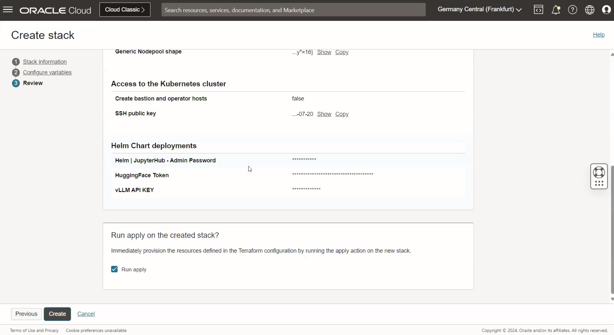

# Provision of resources to run JupyterHub Notebook

## Introduction

This lab will take you through the steps needed to provision the infrastructure using Resource manager and access Jupyter notebooks.

Estimated Time: 30 minutes

### Objectives

Provisioning of infrastructure using Resource manager.

### Prerequisites

This lab assumes you have:

* An Oracle Cloud account
* Administrator permissions or permissions to use the OCI Compute and Identity Domains
* Access to A10 or GPU shape, Usage of the Terraform code for one click deployment.

## Task 1: Provision resources

1. Go to Resource manager -> Stacks -> Create Stack. Choose My configuration and upload the provided zip file and click Next: [orm_stack_a10_gpu-ai_fin_new_vcn.zip](https://objectstorage.us-ashburn-1.oraclecloud.com/p/MowTvhjhvgsR5msJwtCzVxhveQKdE9T0ii9jcWnCZvwKScoR7TFkuDdCDLITZorc/n/c4u02/b/hosted_workshops/o/orm_stack_a10_gpu-ai_fin_new_vcn.zip)

    

    Or you could use a single click deployment button shown below

    [](https://cloud.oracle.com/resourcemanager/stacks/create?zipUrl=https://objectstorage.us-ashburn-1.oraclecloud.com/p/MowTvhjhvgsR5msJwtCzVxhveQKdE9T0ii9jcWnCZvwKScoR7TFkuDdCDLITZorc/n/c4u02/b/hosted_workshops/o/orm_stack_a10_gpu-ai_fin_new_vcn.zip)

2. Provide the information for **Compartment**, **VM Display Name (Any suitable name)**, **Shape (Keep GPU A10 shape)**, **Operating System (Either Oracle Linux or Canonical Ubuntu (According to your preference)**, **Operating System Version (If you choose Oracle Linux then it should be 8 otherwise 24.04 for Ubuntu)**

3. Provide your SSH Key to access the instance. Fill AD, VCN and Subnet Information.

4. Click Next and then select Run Apply and finally click on Create as shown below.

    

5. Wait for the Job to succeed. It may take 5-10 minutes for it to be successful and before infrastructure is provisioned.

## Task 2: Access the notebooks

1. Once the instance is created, wait for the cloud init completion and then you can allow firewall access to be able to launch the jupyter notebook interface.

2. Go to security list of your subnet and give access to port 8888.

3. Copy the Public IP of the instance and ssh into the instance using Terminal.

4. Some commands to check the progress of cloudinit completion and GPU resource utilization:

    ```text
        <copy>
        monitor cloud init completion: tail -f /var/log/cloud-init-output.log
        </copy>
    ```

    ```text
        <copy>
        nvidia-smi dmon -s mu -c 100
        </copy>
    ```

    ```text
        <copy>
        watch -n 2 'nvidia-smi'
        </copy>
    ```

    ```text
        <copy>
        watch -n 5 'ps aux | grep python | egrep "triton|domino"'
        </copy>
    ```

    ```text
        <copy>
        sar 3 1000
        </copy>
    ```

5. If you chose Oracle Linux as your operating system then run the following commands for Jupyter access.

    ```text
        <copy>
        sudo firewall-cmd --zone=public --permanent --add-port 8888/tcp
        </copy>
    ```

    ```text
        <copy>
        sudo firewall-cmd --reload
        </copy>
    ```

    ```text
        <copy>
        sudo firewall-cmd --list-all
        </copy>
    ```

    > **Note**
        > In case that you reboot the system you will need to manually start jupyter notebook. Make sure you execute the following commands from /home/opc.
            ```text
                <copy>
                conda activate triton_example
                </copy>
            ```
            ```text
                <copy>
                > jupyter.log
                </copy>
            ```
            ```text
               <copy>
               nohup jupyter notebook --ip=0.0.0.0 --port=8888 > /home/opc/jupyter.log 2>&1 &
               </copy>
            ```

    Finally run *cat jupyter.log* and get the access token and make the following URL to access jupyter notebooks where VMPUBIP would be public IP of your instance.

    https://VMPUBIP:8888/tree?token=XXXXXXXXXXXXXXXXX

6. If you chose Ubuntu as your operating system then run the following commands for Jupyter access.

    ```text
        <copy>
        sudo iptables -L
        </copy>
    ```

    ```text
        <copy>
        sudo iptables -F
        </copy>
    ```

    ```text
        <copy>
        sudo iptables-save > /dev/null
        </copy>
    ```

    If this does not work do also this:

    ```text
        <copy>
        sudo systemctl stop iptables
        </copy>
    ```

    ```text
        <copy>
        sudo systemctl disable iptables
        </copy>
    ```

     ```text
        <copy>
        sudo systemctl stop netfilter-persistent
        </copy>
    ```

    ```text
        <copy>
        sudo systemctl disable netfilter-persistent
        </copy>
    ```

    ```text
        <copy>
        sudo iptables -F
        </copy>
    ```

     ```text
        <copy>
        sudo iptables-save > /dev/null
        </copy>
    ```

    > **Note**
        > In case that you reboot the system you will need to manually start jupyter notebook. Make sure you execute the following commands from /home/ubuntu.
            ```text
                <copy>
                conda activate triton_example
                </copy>
            ```
            ```text
                <copy>
                > jupyter.log
                </copy>
            ```
            ```text
               <copy>
               nohup jupyter notebook --ip=0.0.0.0 --port=8888 > /home/ubuntu/jupyter.log 2>&1 &
               </copy>
            ```

    Finally run *cat jupyter.log* and get the access token and make the following URL to access jupyter notebooks where VMPUBIP would be public IP of your instance.

    https://VMPUBIP:8888/tree?token=XXXXXXXXXXXXXXXXX

Once the deployment is successful, user can connect to Jupyter Notebook and review the step by step analysis. These lab files guide users through various stages of implementing, deploying, and analyzing financial fraud detection models using advanced machine learning techniques and GPU acceleration. The labs demonstrate the use of XGBoost, SMOTE, Triton Inference Server, and RAPIDS to achieve high-performance fraud detection

You may now proceed to the next lab.

## Acknowledgements

**Authors**

* **Bogdan Bazarca**, Senior Cloud Engineer, NACIE
* **Abhinav Jain**, Senior Cloud Engineer, NACIE