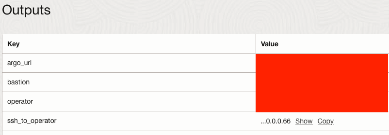
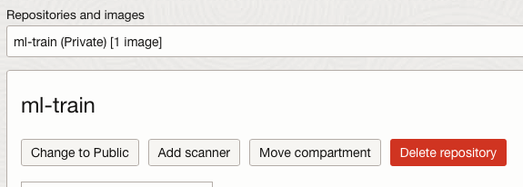
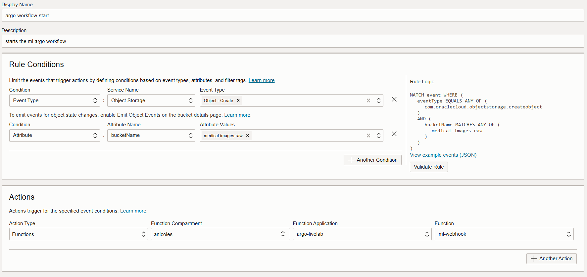

# Configure the pipeline

## Introduction

This lab will guide you through the steps needed to set up the pipeline.

Estimated Time: 1 hour 30 minutes

### Objectives

This lab contains an example on how to set up and configure the automated Argo Workflow pipeline.

### Prerequisites

This lab assumes you have:

* An Oracle Cloud account
* Administrator privileges or access rights to the OCI tenancy
* Ability to create resources with Public IP addresses (Load Balancer, Instances, OKE API Endpoint)
* Ability to create OCI Functions
* Ability to create Dynamic Groups
* An OCI Auth token generated

## Task 1: Create the OCIR images

1. Once the job has succeeded go to Stack details -> Output and copy the ssh_to_operator value.

 

2. With the ssh command copied connect to the operator instance from the machine that you provided the ssh key during the provisioning of the infrastructure.

3. Once logged into the operator, go into the **ml_training_medical_images** directory.

    `cd  ml_training_medical_images`

4. Now we need to login to OCIR. For this you need to have an OCI Auth Token generated as mentioned in the prerequisites. Copy, edit and execute the following commands in order to login into OCIR, create the OCIR image and push it.

    `podman login -u '<NAMESPACE>/oracleidentitycloudservice/<USERNAME>' <OCI REGION PREFIX>.ocir.io`

    `podman build -t <OCI REGION PREFIX>.ocir.io/<NAMESPACE>/ml-train:latest -f Dockerfile.train`

    `podman push <OCI REGION PREFIX>.ocir.io/<NAMESPACE>/ml-train:latest`

    The **NAMESPACE** is usually the name of the Tenancy and the **OCI REGION PREFIX** is the prefix in which you are running the livelab(for example phx for Phoenix). 

    Once the image has been pushed you need to go to OCIR in the web console and set the repository from private to public. The image is created in the ROOT compartment.

    

    NOTE: If the login command does not work use `podman login <OCI REGION PREFIX>.ocir.io` and provide the username as the format above.

## Task 2: Create an OCI Function

1. For this Task we will be using the Cloud Shell function for in order to make easy configurations. Go to OCI web console and in the top left corner select the Cloud Shell option.

2. While the Cloud Shell initializes download the function body from [here](https://objectstorage.eu-frankfurt-1.oraclecloud.com/p/gYkjyFZZxImrAqhCl2UkQ2_XGh9RXk23KMge-yxyZOeLtZUGK5Hvmj96XpOeKvam/n/ocisateam/b/LiveLabs/o/argo-wf-webhook.zip).

3. Once the Cloud Shell initializes in the web console go to Applications and create a new application. Set an appropriate name for it and then select a VCN which has a public subnet with internet access.

4. After the application is created follow the steps **1 through 7** from Getting started - Cloud Shell setup.

5. Once you reach step 8 use the following commands instead:

    `fn init --runtime python ml-webhook`

    And **DO NOT** execute steps 9 through 11.

6. Upload to the Cloud Shell the function that was downloaded at step 2. You can find the upload option on the right corner of the cloud shell window. 

7. After the upload to Cloud Shell finishes, unzip it using this command:

    `unzip -j argo-wf-webhook.zip -d ml-webhook`

If you named your function differently than put the correct directory name. Approve the replacement of the files.

8. Now we are going to deploy the function in our application:

`cd ml-webhook`

`fn -v deploy --app argo-livelab` 

(use the correct application name here if you have not used the same name)

9. While the function is being deployed go back to the operator and execute the following command to obtain the ARGO_TOKEN used for login:

`ARGO_TOKEN="$(kubectl get secret oracle.service-account-token -o=jsonpath='{.data.token}' | base64 --decode)"`
`echo $ARGO_TOKEN`

Then copy the value returned by the echo command.

10. Once the deploy has finished, in web console go to the Configuration section of the Application and create the following two key:value pairs:

ARGO_TOKEN:the value you copied at step 8

ARGO_SERVER_URL:go to Stack details -> Output and you can find it there

10. In order for the function to work we also need to create the following Dynamic Group and Policies:

DG: resource.compartment.id = '< ocid where you created the funcion >'

Policy: `Allow dynamic-group <name of the DG> to use functions-family in compartment <name of the compartment from the DG>`

## Task 3: Create an Event and link it to the Function

1. In the webconsole search for Events Service and select Rules in the Services section.

2. Create a Rule that triggers the execution of the function we just created every time an image is uploaded in the Object Storage. Bellow you can find an example on how to setup the rule. During the provision step we also created 3 Object Storage buckets and we need to trigger the function only when uploading to raw bucket.

You may proceed to the next lab.

## Acknowledgements

**Authors**

* **Dragos Nicu**, Senior Cloud Engineer, NACIE
* **Last Updated By/Date** - Dragos Nicu, January 2025
