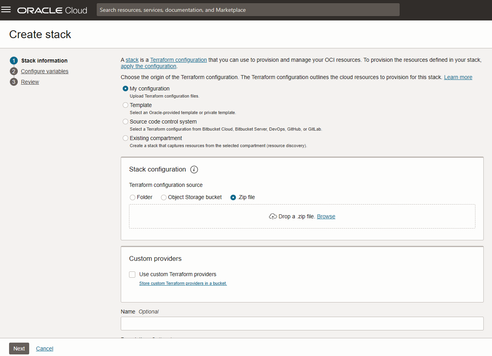

# Provision of basic infrastructure to run the pipeline

## Introduction

This lab will guide you through the steps needed to provision the infrastructure using the Resource Manager.

Estimated Time: 45 minutes

### **Objectives**

Provisioning of the infrastructure using OCI Resource Manager.

### **Prerequisites**

This lab assumes you have:

* An Oracle Cloud account
* Administrator privileges or access rights to the OCI tenancy
* Ability to create resources with Public IP addresses (Load Balancer, Instances, OKE API Endpoint)
* Ability to create Dynamic Groups

## Task 1: Provision resources

1. Go to Resource manager -> Stacks -> Create Stack. Choose My configuration and upload the provided zip file and click Next: [livelab-ml-argo.zip](https://objectstorage.eu-frankfurt-1.oraclecloud.com/p/H8n5BNFfGOUfOh32BLXbS9At_ZvCVM4dS43HizvgTbU9u5Dy151FIz7r9R7Jmepu/n/ocisateam/b/LiveLabs/o/livelab-ml-argo.zip)

    

    Or you could use the single click deployment button shown below

    

2. Provide the following information: 

**Select Compartment**: Choose the appropriate compartment for the Kubernetes cluster.
**Cluster Name**: Enter a descriptive name for the cluster.
**Create New VCN**: Check the option to create a new VCN, provide a name, and leave other networking details as default.
**Node Pool Configuration**: set the nodepool size to two and leave the rest of the settings to default.

3. Next, check all 3 options in Access to the Kubernetes cluster and provide your ssh key to connect to the bastion and operator hosts.

    You can deploy the resources in two ways. Either you create a bastion and operator hosts. These are two VMs and operator host would be configured with kubectl so you can directly execute command from operator against the kubernetes cluster or commands can be executed from oracle resource manager runner.

    If you do not select this option then it is mandatory to have a public OKE endpoint. But if you create bastion and operator hosts then creating a public oke endpoint is optional. For this workshop we will check all 3 and leave as default. Provide your public key to connect to the bastion and operator hosts.

4. Next, in Helm Chart deployments section check all the 3 boxes and leave them as default. No need to provide the optional file.

5. Click Next and then select Run Apply and finally click on Create as shown below.

    

6. Wait for the job to complete, which may take 20-30 minutes before the infrastructure is fully provisioned.

You may now proceed to the next lab.

## Acknowledgements

**Authors**

* **Dragos Nicu**, Senior Cloud Engineer, NACIE
* **Last Updated By/Date** - Dragos Nicu, January 2025
