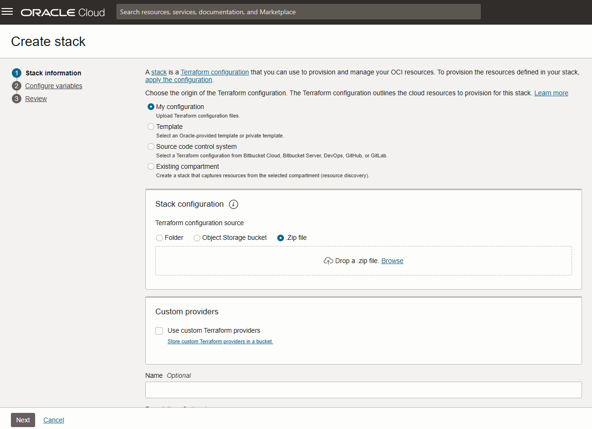
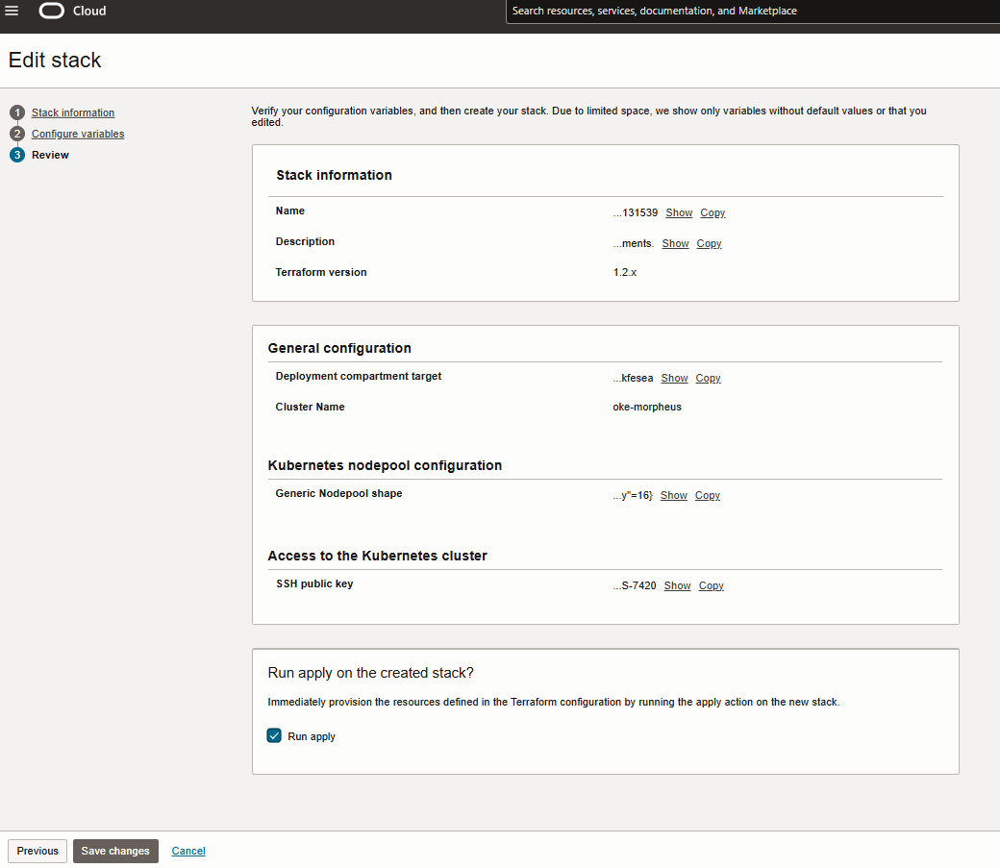

# Morpheus on Kubernetes: OKE Setup and Jupyter Notebooks

## Introduction

This lab guides you through provisioning the necessary infrastructure using Oracle Cloud Infrastructure (OCI) Resource Manager (ORM) and deploying an Oracle Kubernetes Engine (OKE) cluster to support the NVIDIA Morpheus framework. After provisioning, you will access the OKE cluster to set up and interact with Jupyter notebooks that demonstrate the functionality of the Morpheus framework.

Estimated Time: 30 minutes

### Objectives

* Provisioning of infrastructure using Resource manager.
* Setting up the access to the deployed OKE cluster and the related Jupyter notebooks.
* Running Jupyter notebooks for TabFormer and Sparkov fraud detection models as part of workflows built within the Morpheus framework.

### Prerequisites

This lab assumes you have:

* An Oracle Cloud account
* Administrator permissions or permissions to use the OCI Compute, Kubernetes Clusters (OKE) and Networking services.
* Access to A10 or GPU shape
* Access to the Oracle Resource Manager(ORM)

## Task 1: Provision resources

1. You will begin by creating the stack to run the automation code in the OCI ORM.

    * Create the ORM stack manually.
    * Go to _Developer Services_ -> _Resource manager_ -> _Stacks_ -> _Create Stack_.
    * Choose _My configuration_, upload this [Morpheus automation stack](https://github.com/bogdanbazarca/orm_morpheus_fraud_detection_oke) and click **Next**.

    

    OR

    * You can use the single click deployment button below to launch the stack creation directly, accept the temrs and click **Next**.

    [](https://cloud.oracle.com/resourcemanager/stacks/create?zipUrl=https://github.com/bogdanbazarca/orm_morpheus_fraud_detection_oke/archive/refs/heads/main.zip)

2. Choose or fill in the deployment options, including:

    * **Compartment** and **Cluster Name** (default: "oke").
    
    

    * Create new VCN (if needed, otherwise you can use an existing VCN) and customize the networking options
    
    

    * **Kubernetes nodepool configuration** (Generic Nodepool size, Generic Nodepool shape, Generic Nodepool boot volume size - default is 200GB).
    
    

    * Access to the Kubernetes cluster - select if you want to **Create bastion and operator hosts**, **Create operator IAM policy**, **Create public OKE API** and provide **SSH public key**.
    
    

4. Click **Next** and then select _Run Apply_ and finally click on **Create** as shown below.

    

5. Wait for the Job to succeed. It may take up 30 minutes for it to be successful and before infrastructure is provisioned.

## Task 2: Access the oke cluster via operator

1. After the stack is created, wait for the process to complete. Once finished, it will provide the necessary details to access the OKE cluster through the operator and bastion host, provided you selected this option in Task 1, point 2.

2. The stack's output will include the following details:

   * **Bastion**: The external IP address of the created bastion host.
   * **Operator**: The private IP address of the operator host.
   *  **SSH Tunnel Command**: Instructions on how to connect to the operator host via an SSH tunnel:
   ```
   ssh -o ProxyCommand='ssh -W %h:%p opc@<bastion_Public_IP>' opc@<operator_Private_IP>
   ```

3. Copy the `ssh_to_operator` command and execute in Terminal.

## Task 3: Access the OKE cluster and Morpheus pod

1. After running the _ssh_to_operator_ command in a terminal, you will be connected to the operator VM. This VM is equipped with all the necessary utilities to access the OKE cluster and execute kubectl commands.

    Run the below command to check the status and configuration of the OKE cluster once connected to the operator:

    ```
    k get all -A
    ```

    This command helps you verify if the pods and services have been successfully created and ensures there are no errors. Additionally, you can retrieve the Load Balancer's public IP address to use for testing the model query.

    

2. You can also collect the Load Balancer Public IP using the below command:

    ```
    kubectl get service fraud-detection-app -o jsonpath='{.status.loadBalancer.ingress[0].ip}'
    ```

3. Access Jupyter notebooks

    Use the Load Balancer public IP address, port 8888, and the authentication token found in the _fraud-detection-app*_ pod log file to access the Jupyter notebooks that will allow you to test running models against Morpheus on OKE.

    ```
    k logs fraud-detection-app-...
    ```
    
    and look for a value like this: **http://hostname:8888/tree?token=....**

    Replace "localhost" or "127.0.0.1" with the public IP address of the LoadBalancer, and paste the updated link into your browser to access the Jupyter Notebooks directly.

    

    Browse the _notebooks_ directory to view all the available notebooks.


## Task 4: Run TabFormer Jupyter notebooks in the Morpheus AI workflow for fraud detection

### Steps for Executing TabFormer Notebooks

1. **Preprocessing: `preprocess_Tabformer.ipynb`**  

    Run this notebook to preprocess the data - run cells one by one by pressing _Shift+Enter_, or select from the menu _Run_ -> _Run All Cells_.

    
    
    Outputs:
    * Files saved under `./data/TabFormer/gnn` and `./data/TabFormer/xgb`.
    * Preprocessor pipeline saved as `preprocessor.pkl`.
    * Variables saved in `variables.json` under `./data/TabFormer`.


2. **Training: `train_gnn_based_xgboost.ipynb`**
    
    **Important**: Before running, ensure Cell 2 has the value: `DATASET = TABFORMER`.

    Run the notebook cells to train the GNN-based XGBoost model.  

    **Outputs**:

    * Model files saved in `./data/TabFormer/models`. 

    * There is also an output at the end of the notebook:


3. **Inference: `inference_gnn_based_xgboost_TabFormer.ipynb`**  
    
    Use this notebook to perform inference on unseen data.  
    
    **Important**: 
    * In Cell 2, set: `dataset_base_path = '../data/TabFormer/'`.  
    * In Cell 13, ensure the TabFormer-specific selection is uncommented.

    Run the notebook.

**Optional: Pure XGBoost**  
    
    For building and inferring with a pure XGBoost model (without GNN):  
    
4. **Training**: `train_xgboost.ipynb`

    Produces an XGBoost model in `./data/TabFormer/models`.  

    **Important**: In Cell 2, set: `DATASET = TABFORMER`.

    Run the notebook. 
    
5. **Inference**: `inference_xgboost_TabFormer.ipynb`

    Use this notebook for inference with the pure XGBoost model.

    Run the notebook.


## Task 5: Run Sparkov Jupyter notebooks in the Morpheus AI Workflow for fraud analysis

### Steps for Executing Sparkov Notebooks

1. **Preprocessing: `preprocess_Sparkov.ipynb`**  

    Run this notebook to preprocess the Sparkov dataset - run cells one by one by pressing _Shift+Enter_, or select from the menu _Run_ -> _Run All Cells_.  
   
    **Outputs**:

    * Files saved under `./data/Sparkov/gnn` and `./data/Sparkov/xgb`.
    * Preprocessor pipeline saved as `preprocessor.pkl`.
    * Variables saved in `variables.json` under `./data/Sparkov`.

2. **Training: `train_gnn_based_xgboost.ipynb`**  
   
    Train the GNN-based XGBoost model for Sparkov.  

    **Important**: Before running, ensure Cell 2 has the value: `DATASET = SPARKOV`.

    Run the notebook.

    **Outputs**:

    * Model files saved in `./data/Sparkov/models`.  

**Optional: Pure XGBoost**  
    
    For building and inferring with a pure XGBoost model (without GNN):  
    
3. **Training**: `train_xgboost.ipynb`

    Produces an XGBoost model in `./data/Sparkov/models`.  
    
    **Important**: In Cell 2, set: `DATASET = SPARKOV`.  

    Run the notebook.

4. **Inference**: `inference_xgboost_Sparkov.ipynb`

    Use this notebook for inference with the pure XGBoost model.  
    
    **Important**:
    * In Cell 2, set: `dataset_base_path = '../data/Sparkov/'`.  
    * In Cell 13, ensure the Sparkov-specific content is uncommented.

    Run the notebook.


## Acknowledgements

* **Author** Bogdan Bazarca, Senior Cloud Engineer, NACIE
* **Last Updated By/Date**: Bogdan Bazarca - Senior Cloud Engineer, Nov 2024
