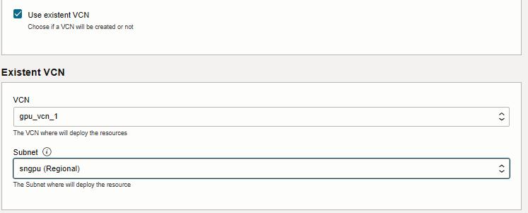
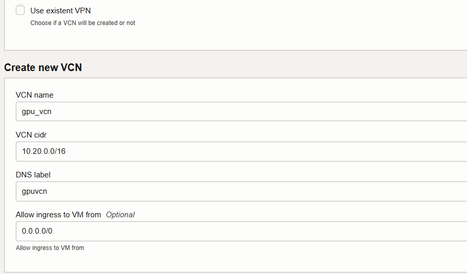

# Provision of resources Standalone Morpheus on OCI A10 instance

## Introduction

This lab will walk you through the steps for automatically deploying Morpheus in a standalone configuration. Using Oracle Resource Manager (ORM), you will set up the environment required to run workflows and test Jupyter notebooks for Sparkov and TabFormer.

Estimated Time: 30 minutes

### Objectives

Provisioning of infrastructure using Resource manager.

### Prerequisites

This lab assumes you have:

* An Oracle Cloud account
* Administrator permissions or permissions to use the OCI Compute and OCI Networking services
* Access to A10 or GPU shape
* Access to the Oracle Resource Manager(ORM)

## Task 1: Provision resources

1. You will begin by creating the stack to run the automation code in the OCI ORM.

    * Create the ORM stack manually.
    * Go to _Developer Services_ -> _Resource manager_ -> _Stacks_ -> _Create Stack_.
    * Choose _My configuration_, upload this [Morpheus automation stack](https://github.com/bogdanbazarca/orm_morpheus_fraud_detection/archive/refs/heads/main.zip) and click **Next**.

        

    OR

    * You can use the single click deployment button below to launch the stack creation directly, the click **Next**.

        [](https://cloud.oracle.com/resourcemanager/stacks/create?zipUrl=https://github.com/bogdanbazarca/orm_morpheus_fraud_detection/archive/refs/heads/main.zip)


2. Choose or fill in the deployment options, including:

    * Compartment, VM display name, Shape, Operating System [Canonical Ubuntu or Oracle Linux], Operating System Version [24.04 or 8], Public SSH Key, availability domain.

        

    * Select if you want to use an existent VCN or fill in the details for creating a new one:
    
        
    
    * If you choose to create new VCN:
    
        

    * Click **Next**.

3. Create and run the stack:
    
    * Review the options selected in the previous steps and then select _Run Apply_ and finally click on **Create** as shown below.
        
        

4. Wait for the job to complete, which should only take a few minutes. Once the job finishes and the VM is provisioned, the cloud-init instructions will continue running in the background. For more details on monitoring progress, refer to the instructions in the next section.

    * Review the Job status:

       

    

## Task 2: Access the instance

1. Once the job is complete, you can connect to the newly created instance via SSH.

2. When the stack deployment is complete, you can find details about the instance in the job log or the stack's output section.

    * **`VM_PUB_IP`** [`Instance_Public_IP`]
    * **`VM_PRIV_IP`** [`Instance_Private_IP`]

3. Open a terminal and run the following command to connect to your instance:  

   * For Oracle Linux: 
   ```
   ssh opc@<VM_PUB_IP>
   ```
   * For Ubuntu: 
   ```
   ssh ubuntu@<VM_PUB_IP>
   ```

4. Check the cloudinit completion (It may take between 20 and 25 minutes based on the selected OS):

    ```
    tail -f /var/log/cloud-init-output.log
    ```
    
    Based on the OS you will see the following message:
    
    `Cloud-init v. 24.3.1-0ubuntu0~24.04.2 finished...`

    OR
    
    `Cloud-init v. 23.4-7.0.1.el8_10.7 finished...`
    
    You can exit this command with CTRL+C (CONTROL+C for MAC).

## Task 3: Access Morpheus

1. To allow public access to the Morpheus VM on port 8888 (Jupyter Notebook), follow these steps:

    * **Oracle Linux:**

    ```
    sudo firewall-cmd --zone=public --permanent --add-port 8888/tcp
    sudo firewall-cmd --reload
    sudo firewall-cmd --list-all
    conda activate fraud_conda_env
    ```

    **Note**: If you reboot the system, you will need to manually restart the Jupyter Notebook. Follow these steps from the /home/opc directory:

    * Activate the conda environment:
        
        ```
        conda activate fraud_conda_env
        ```

    * Start the Jupyter Notebook in the background:

        ```
        > jupyter.log
        nohup jupyter notebook --ip=0.0.0.0 --port=8888 > /home/opc/jupyter.log 2>&1 &
        ```

    * Retrieve the access token by running:

        ```cat /home/opc/jupyter.log```

    * **Ubuntu:**

    ```
    sudo iptables -L
    sudo iptables -F
    sudo iptables-save > /dev/null
    conda activate fraud_conda_env
    ```

    If this does not work do also this:

    ```
    sudo systemctl stop iptables
    sudo systemctl disable iptables

    sudo systemctl stop netfilter-persistent
    sudo systemctl disable netfilter-persistent

    sudo iptables -F
    sudo iptables-save > /dev/null
    ```

2. Test tritonllm inference from the created instance (once the cloudinit completes)

    ```
    <copy>
    curl -X POST http://localhost:8000/v2/models/ensemble/generate -d   '{"text_input": "What is machine learning?", "max_tokens": 20, "bad_words": "", "stop_words": ""}'
    ```

3. Test tritonllm inference from the created instance (once the cloudinit completes and firewall rule permits the acces)

    ```
    <copy>
    curl -X POST http://`<instance_public_ip>`:8000/v2/models/ensemble/generate -d   '{"text_input": "What is machine learning?", "max_tokens": 20, "bad_words": "", "stop_words": ""}'
    ```

You may now proceed to the next lab.

## Acknowledgements

* **Author** Bogdan Bazarca, Senior Cloud Engineer, NACIE
* **Last Updated By/Date**: Bogdan Bazarca - Senior Cloud Engineer, Nov 2024
