# Morpheus on A10 VM: Standalone Setup and Jupyter Notebooks

## Introduction

This lab will walk you through the steps for automatically deploying Morpheus in a standalone configuration. Using Oracle Resource Manager (ORM), you will set up the environment required to run workflows and test Jupyter notebooks for Sparkov and TabFormer.

Estimated Time: 60 minutes

### Objectives

* Provisioning of infrastructure using Resource manager.
* Setting up the access to the Morpheus VM and the related Jupyter notebooks.
* Running Jupyter notebooks for TabFormer and Sparkov fraud detection models as part of workflows built within the Morpheus framework.

### Prerequisites

This lab assumes you have:

* An Oracle Cloud account
* Administrator permissions or permissions to use the OCI Compute and OCI Networking services
* Access to A10 or GPU shape
* Access to the Oracle Resource Manager(ORM)

## Task 1: Provision resources

1. You will begin by creating the stack to run the automation code in the OCI ORM.

    * Create the ORM stack manually.
    * Go to _Developer Services_ -> _Resource manager_ -> _Stacks_ -> _Create Stack_.
    * Choose _My configuration_, upload this [Morpheus automation stack](https://github.com/dranicu/orm_morpheus_fraud_detection) and click **Next**.

        

    OR

    * You can use the single click deployment button below to launch the stack creation directly, accept the terms and click **Next**.

        [](https://cloud.oracle.com/resourcemanager/stacks/create?zipUrl=https://github.com/dranicu/orm_morpheus_fraud_detection/archive/refs/heads/main.zip)


2. Choose or fill in the deployment options, including:

    * **Compartment**, **VM display name**, **Shape**, **Operating System** (Canonical Ubuntu or Oracle Linux), **Operating System Version** (24.04 or 8), **Public SSH Key**, **availability domain**.

        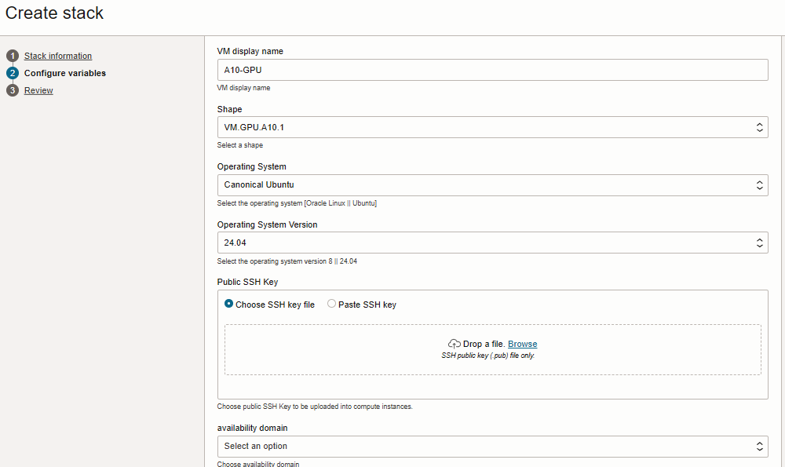

    * Select if you want to use an existent VCN or fill in the details for creating a new one:
    
        
    
    * If you choose to create new VCN:
    
        

    * Click **Next**.

3. Create and run the stack:
    
    * Review the options selected in the previous steps and then select _Run Apply_ and finally click on **Create** as shown below.
        
        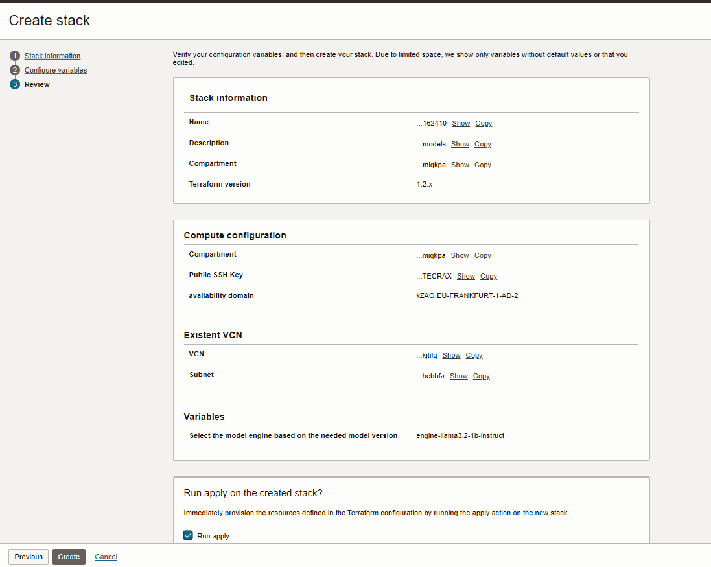

4. Wait for the job to complete, which should only take a few minutes. Once the job finishes and the VM is provisioned, the cloud-init instructions will continue running in the background. For more details on monitoring progress, refer to the instructions in the next section.

    * Review the Job status:

       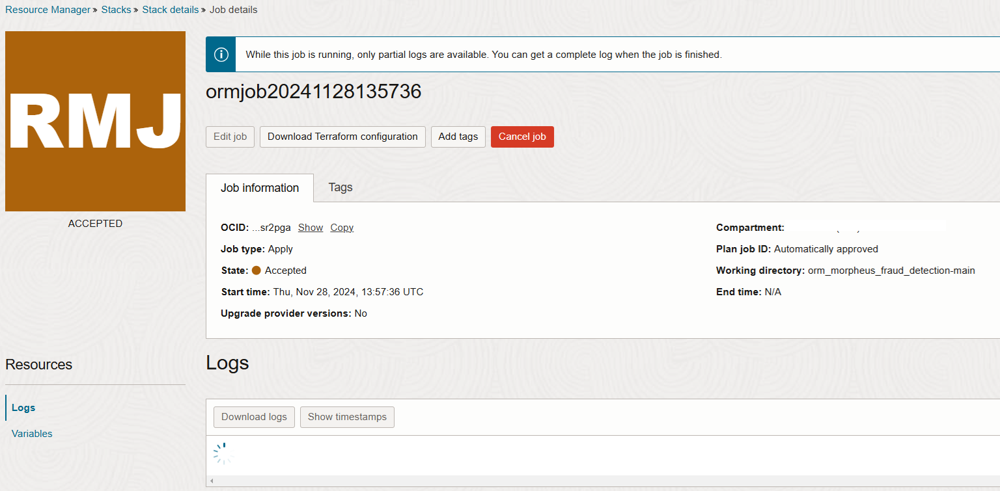

    

## Task 2: Access the instance

1. Once the job is complete, you can connect to the newly created instance via SSH.

2. When the stack deployment is complete, you can find details about the instance in the job log or the stack's output section.

    * **`VM_PUB_IP`** [`Instance_Public_IP`]
    * **`VM_PRIV_IP`** [`Instance_Private_IP`]

3. Open a terminal and run the following command to connect to your instance:  

   * For Oracle Linux: 
   ```
   <copy>
   ssh opc@<VM_PUB_IP>
   ```
   * For Ubuntu: 
   ```
   ssh ubuntu@<VM_PUB_IP>
   ```

4. Check the cloudinit completion (It may take between 20 and 25 minutes based on the selected OS):

    ```
    tail -f /var/log/cloud-init-output.log
    ```
    
    Based on the OS you will see the following message:
    
    `Cloud-init v. 24.3.1-0ubuntu0~24.04.2 finished...`

    OR
    
    `Cloud-init v. 23.4-7.0.1.el8_10.7 finished...`
    
    You can exit this command with CTRL+C (CONTROL+C for MAC).

## Task 3: Access Morpheus

1. To allow public access to the Morpheus VM on port 8888 (Jupyter Notebook), follow these steps:

    * **Oracle Linux:**

        ```
        sudo firewall-cmd --zone=public --permanent --add-port 8888/tcp
        sudo firewall-cmd --reload
        sudo firewall-cmd --list-all
        conda activate fraud_conda_env
        ```

    * **Ubuntu:**

        ```
        sudo iptables -L
        sudo iptables -F
        sudo iptables-save > /dev/null
        conda activate fraud_conda_env
        ```

        If the above steps do not resolve the issue, try the following:
    
        ```
        sudo systemctl stop iptables
        sudo systemctl disable iptables
    
        sudo systemctl stop netfilter-persistent
        sudo systemctl disable netfilter-persistent
    
        sudo iptables -F
        sudo iptables-save > /dev/null
        ```

    **Note**:  For both OS versions, if you reboot the system, you will need to manually restart the Jupyter Notebook. Follow these steps in a terminal from the _/home/opc_ for Linux  or _/home/ubuntu_ for Ubuntu directory:

    * Activate the conda environment:
        
        ```
        conda activate fraud_conda_env
        ```

    * Start the Jupyter Notebook in the background:

        ```
        # Oracle Linux
        > jupyter.log
        nohup jupyter notebook --ip=0.0.0.0 --port=8888 > /home/opc/jupyter.log 2>&1 &
        
        # OR

        # Ubuntu
        > jupyter.log
        nohup jupyter notebook --ip=0.0.0.0 --port=8888 > /home/ubuntu/jupyter.log 2>&1 &
        ```

    * Retrieve the access token, as described in the next step, by running:

        ```
        # Oracle Linux
        cat /home/opc/jupyter.log
        
        # OR

        # Ubuntu
        cat /home/ubuntu/jupyter.log
        ```

2. After deployment and the above access configuration, Jupyter Notebooks for TabFormer and Sparkov will be accessible on the VM. Use the public IP address of the VM, port 8888, and the authentication token found in the jupyter.log file to access the notebooks.

     ```
     cat jupyter.log
     ```

     Example output:

     

     Select any of the above highlighted links, replace "localhost" or "127.0.0.1" with the public IP address of the VM, and paste the updated link into your browser to access the Jupyter Notebooks directly:

     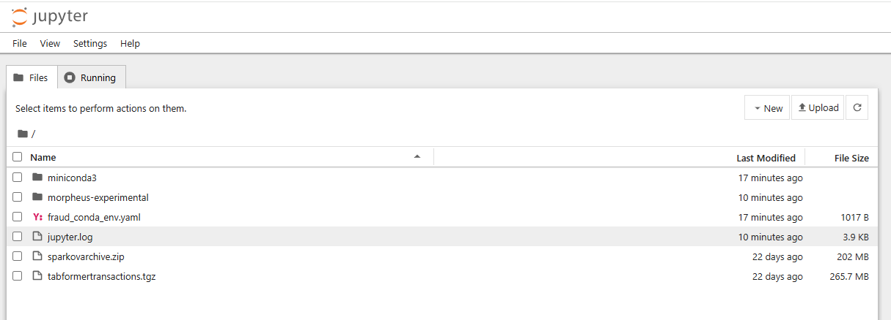

3. After accessing Jupyter on the VM public IP, navigate to the following directory: /morpheus-experimental/ai-credit-fraud-workflow/notebooks/. Here, you can run the available labs. Make sure to select Kernel -> Change Kernel -> Fraud Conda Environment for each notebook before executing.

    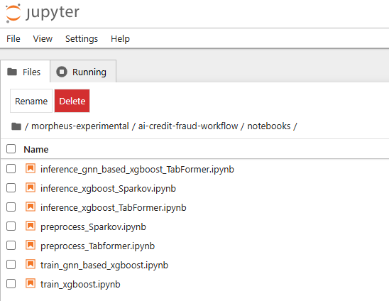

**Note**: In the following tasks, you will work with TabFormer and Sparkov to demonstrate inference for fraud analysis. The notebooks will have to be executed in the correct sequence. For each dataset, you'll start by running the preprocessing notebook to prepare the data. Next, the training notebook will be executed to generate the models. Finally, the inference notebook will be used to analyze unseen data and obtain predictions.

## Task 4: Run TabFormer Jupyter notebooks in the Morpheus AI workflow for fraud detection

### Steps for Executing TabFormer Notebooks

1. **Preprocessing: `preprocess_Tabformer.ipynb`**  

    Select _Kernel_ -> _Change Kernel_ -> _Fraud Conda Environment_ to change the kernel. You need to perform this step for each notebook.

    Run this notebook to preprocess the data - run cells one by one by pressing _Shift+Enter_, or select from the menu _Run_ -> _Run All Cells_.

    
    
    **Outputs**:

    * Files saved in Jupyter under `./data/TabFormer/gnn` and `./data/TabFormer/xgb`.
    * Preprocessor pipeline saved as `preprocessor.pkl`.
    * Variables saved in `variables.json` under `./data/TabFormer`.


2. **Training: `train_gnn_based_xgboost.ipynb`**

    Switch to the _Fraud Conda Environment_ kernel.
    
    **Important**: Before running, ensure Cell 2 has the value: `DATASET = TABFORMER`.

    Run the notebook cells to train the GNN-based XGBoost model.  

    **Outputs**:

    * Model files saved in Jupyter under `./data/TabFormer/models`. 

    * There is also an output at the end of the notebook:

    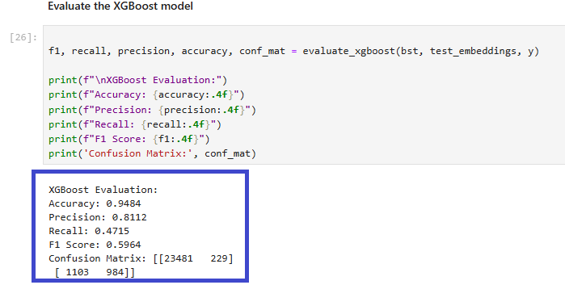


3. **Inference: `inference_gnn_based_xgboost_TabFormer.ipynb`**  
    
    Switch to the _Fraud Conda Environment_ kernel.
    
    Use this notebook to perform inference on unseen data.  
    
    **Important**: 

    * In Cell 2, make sure the following is set: `dataset_base_path = '../data/TabFormer/'`.  
    * In Cell 13, ensure the TabFormer-specific selection is uncommented.

    Run the notebook.

    Example output:

    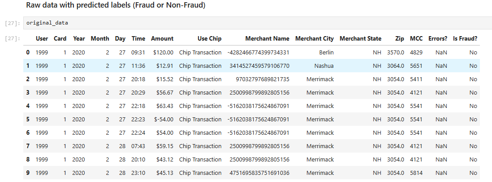

**Optional: Pure XGBoost**  
    
    For building and inferring with a pure XGBoost model (without GNN):  
    
4. **Training**: `train_xgboost.ipynb`

    Produces an XGBoost model in `./data/TabFormer/models`.  
    
    Switch to the _Fraud Conda Environment_ kernel.

    **Important**: In Cell 2, set: `DATASET = TABFORMER`.

    Run the notebook. You will get some graphs:
    
    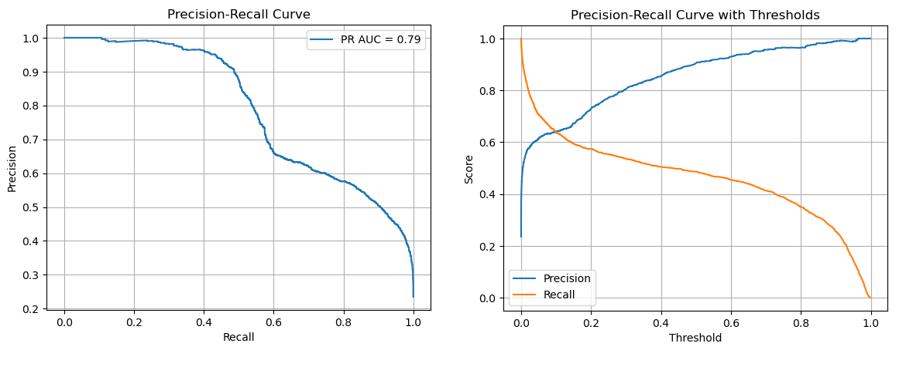
    
5. **Inference**: `inference_xgboost_TabFormer.ipynb`

    Use this notebook for inference with the pure XGBoost model.

    * Switch to the _Fraud Conda Environment_ kernel.

    * Run the notebook.

    * The output on unseen data will be similar to the one below:

    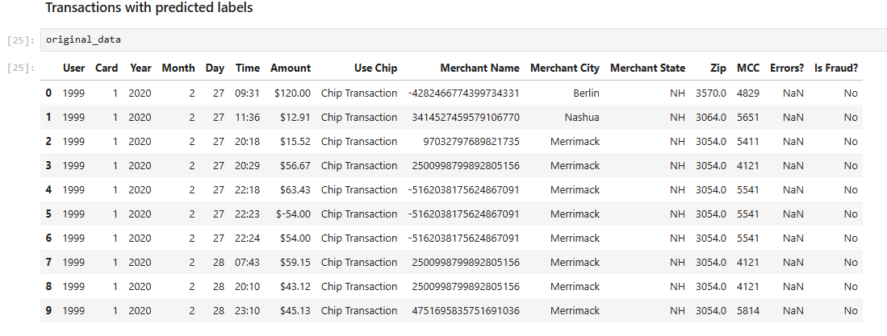


## Task 5: Run Sparkov Jupyter notebooks in the Morpheus AI Workflow for fraud analysis

### Steps for Executing Sparkov Notebooks

1. **Preprocessing: `preprocess_Sparkov.ipynb`**  

    Select _Kernel_ -> _Change Kernel_ -> _Fraud Conda Environment_ to change the kernel. You need to perform this step for each notebook.

    Run this notebook to preprocess the Sparkov dataset - run cells one by one by pressing _Shift+Enter_, or select from the menu _Run_ -> _Run All Cells_.  
   
    **Outputs**:

    * Files saved in Jupyter under `./data/Sparkov/gnn` and `./data/Sparkov/xgb`.
    * Preprocessor pipeline saved as `preprocessor.pkl`.
    * Variables saved in `variables.json` under `./data/Sparkov`.

2. **Training: `train_gnn_based_xgboost.ipynb`**  
   
    Train the GNN-based XGBoost model for Sparkov.  

    Switch to the _Fraud Conda Environment_ kernel.

    **Important**: Before running, ensure Cell 2 has the value: `DATASET = SPARKOV`.

    Run the notebook.

    **Outputs**:

    * Model files saved in Jupyter under `./data/Sparkov/models`.  

    * There is also an output at the end of the notebook:

    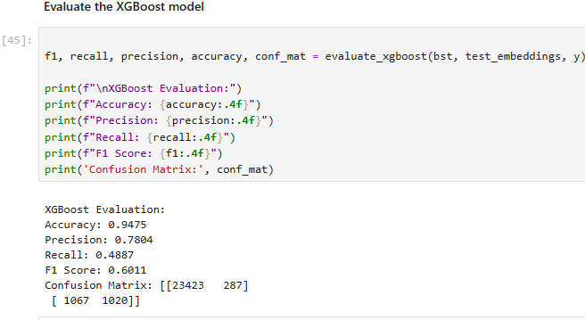

**Optional: Pure XGBoost**  
    
    For building and inferring with a pure XGBoost model (without GNN):  
    
3. **Training**: `train_xgboost.ipynb`

    Produces an XGBoost model in `./data/Sparkov/models`.  

    Switch to the _Fraud Conda Environment_ kernel.
    
    **Important**: In Cell 2, set: `DATASET = SPARKOV`.  

    Run the notebook.

    Example output:

    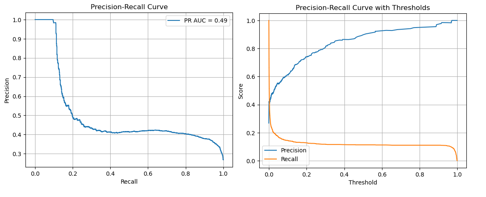
    
4. **Inference**: `inference_xgboost_Sparkov.ipynb`

    Use this notebook for inference with the pure XGBoost model.  
    
    **Important**:

    * In Cell 2, make sure the following is set: `dataset_base_path = '../data/Sparkov/'`.  
    * In Cell 13, ensure the Sparkov-specific content is uncommented.
    
    Switch to the _Fraud Conda Environment_ kernel.

    Run the notebook.

    The output on unseen data will be similar to the one below:

    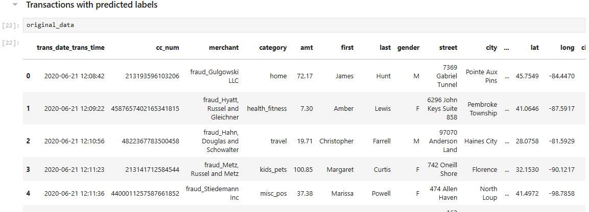

You may now proceed to the next lab.

## Acknowledgements

* **Authors** 
    * Adina Nicolescu - Senior Cloud Engineer, NACIE
    * Bogdan Bazarca, Senior Cloud Engineer, NACIE

* **Last Updated By/Date**
    * Adina Nicolescu - Senior Cloud Engineer, NACIE - Dec 2024
