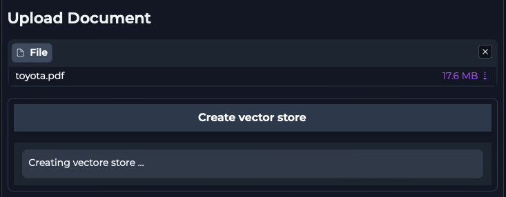

# Retrieval Augmented Generation (RAG) Application

## Introduction

We can exploit the power of LLMs to get answers from our dataset directly. Such a technique is called retrieval-augmented generation, or RAG in short, because you would retrieve the relevant data and use it as augmented context for the LLM. A RAG workflow takes the relevant information out and connects static LLMs with sources pulling in data retrieval. This is instead of relying on knowledge derived only from training. In a RAG pipeline the information is stored inside a Vector DB which in our case will be the Autonomous Database Oracle 23ai. 

In this lab we will explore the Gradio interface and interact with the model that we have loaded in the previous Labs. We will use the Oracle Database 23ai to store document embeddings that will be used in the RAG pipeline.

Note: There the two LLM available in the chatbot, cohere-chat and google/gemma-2-2b-it, this lab is focused on the showcaseing the google/gemma-2-2b-it which was locally instaled on OKE workernodes with GPU capabilites.
For embeddings there are also two models, one from cohere and one from huggingface, and you can use either one however if you want to use the cohere model you need to create an account on Cohere's website: [https://dashboard.cohere.com/welcome/login?redirect_uri=%2Fapi-keys](https://dashboard.cohere.com/welcome/login?redirect_uri=%2Fapi-keys) and generate a Trial key.

Estimated Time: 1 hour

### Objectives

This lab will take you through the steps needed to chat with the Retrieval Augmented Generation (RAG) Application

### Prerequisites

This lab assumes you have:

* An Oracle Cloud account
* Administrator privileges or access rights to the OCI tenancy
* Ability to provision A10 instances in OCI
* Ability to provision an Oracle 23ai Autonomous Database
* Ability to create resources with Public IP addresses (Load Balancer, Instances, OKE API Endpoint)
* Access to Hugging Face and acceptance of selected model license agreements
* Database admin password stored in a vault secret.
* Create an account on Cohere's website: [https://dashboard.cohere.com/welcome/login?redirect_uri=%2Fapi-keys](https://dashboard.cohere.com/welcome/login?redirect_uri=%2Fapi-keys) and generate a Trial key.

## Task 1: Setup the LLM and Embedding models

1. Click on the link for the public gradio interface obtained after the execution of the second cell block.

    

2. A new browser tab will open with the Gradio interface. In this new tab select the google/gemma-2-2b-it model form the drop down meniu and select whichever embedding model you want.

Note: If you wish to use the Cohere embedding model you need to have a Trial key and put it in the embedding API key section.

   

3. Click the Load Model and wait for the models to finish loading

## Task 2: Load a file in the Oracle Database 23ai and chat with the LLM

1. In the Upload Document section of the Gradio interface either drop a file or click it and select the file you wish to upload in the database. Once the file finishes uploading in the pod click **Create Vector Store**

    

2. Once the file is loaded you can start chatting with the LLM and tune the generation parameters. If you change any Text Generation parameter, you have to Click "Load Model" again.

Note: If you want to load multiple files in the database, you need to add them one by one(pressing the X symbol and selecting a different file and clicking Create Vector Store)

3. Now we can start chatting with the LLM and ask him to provide information from the file that we have uploaded. 

4. Once you are ready to terminate your resources you can go to your stack and destroy the stack. All the resources will be terminated except Block volume. You will have to manually delete Block volume.

    

This concludes our RAG application workshop.

## Acknowledgements

**Authors**

* **Dragos Nicu**, Senior Cloud Engineer, NACIE
* **Guido Alejandro Ferreyra**, Principal Cloud Architect,NACIE