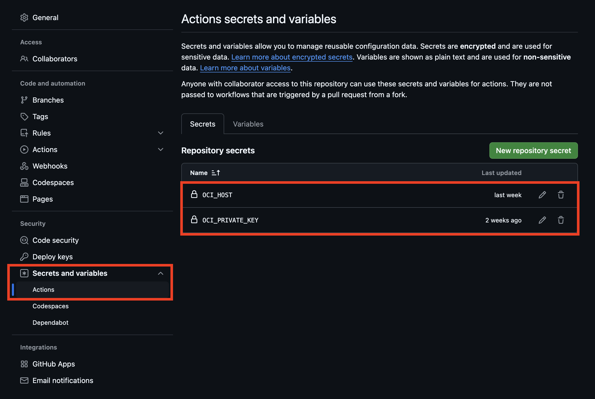
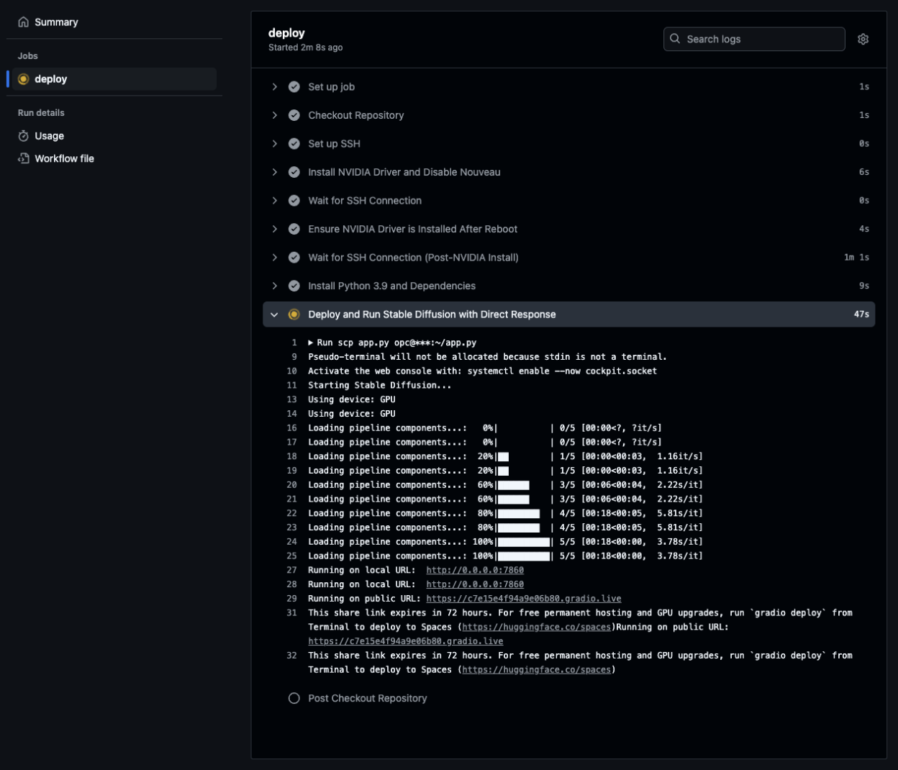
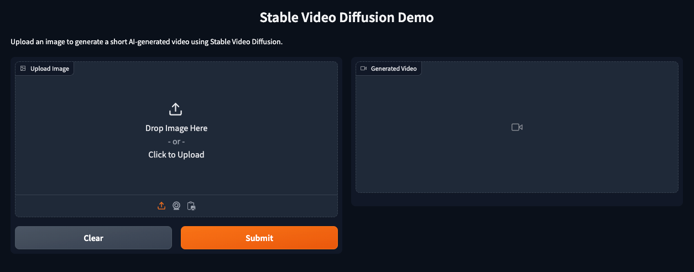
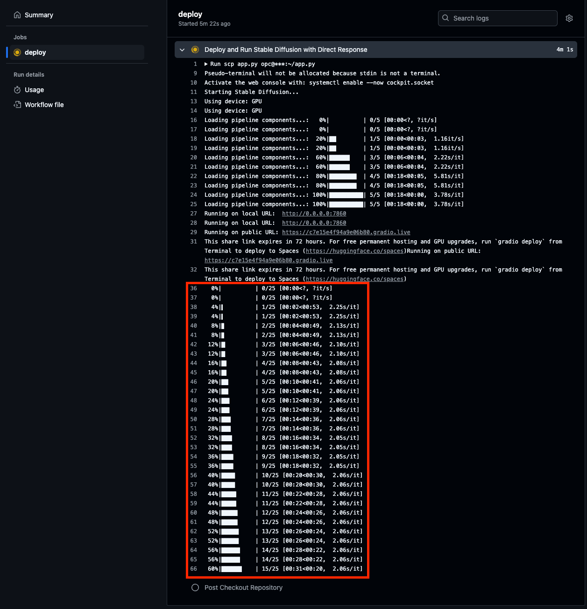
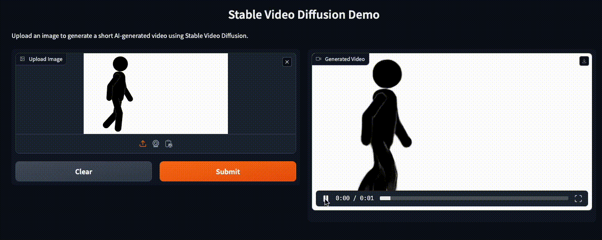

# Lab 2: Deploy Stable Diffusion Application

## Introduction
This live lab guides you through automating the deployment of a Stable Diffusion Python application using GitHub Actions. You will learn to set up a CI/CD pipeline using GitHub Actions to automate instance preconfiguration, install dependencies, and efficiently deploy your application.

Estimated Time: 15 minutes

### About Github Actions
Github Actions from Oracle have been designed and developed by Oracle to enable you to integrate your Github workflows with Oracle Cloud Infrastructure (OCI) services and products. Actions are managed in the same place as all your other repository related features like pull requests and issues, enabling you to manage continuous integration (CI) and continuous deployment (CD) code directly in your repository. 

### Objectives

In this lab, you will:
* Create your own Github repository from downloaded code repo 
* Deploy the python app running the diffusion model
* Test drive the deployed diffusion model


### Prerequisites

This lab assumes you have:
* Complete Lab 1 and the prerequisites in the introduction section

## Task 1: Creating a GitHub Repository from the Downloaded Source Code

1. Create a new private repository from Github

2. Nagivate to repo `settings` -> click on `Secrets and variables` -> click `Actions`.  Create two new repo secrets `OCI_HOST` (Paste the public ip address of the instance provisioned in Lab 1) and `OCI_PRIVATE_KEY` (Your local ssh private key)

    
    

3. Initialize your git repo inside the source code folder with `git init`

4. Add all files to git with `git add .`

5. Commit the files with `git commit -m "Initial commit"`

6. Add your remote Github repository with `git remote add origin <your-repo-url>`

## Task 2: Git Push to Start the Github Actions Workflow

1. Push the code to GitHub with
    ```sh
    git branch -M main
    git push -u origin main
    ```

2. Head back to your Github repository and click `actions` -> select the running workflow -> click `deploy` -> and checkout the log.

    
     

3. Once it gets to the last section `Deploy and Run Stable Diffusion with Direct Response` and you see the line `Running on public URL: https://xxx.gradio.live`, it means our stable diffusion model is up and running in OCI gpu instance.

## Task 3: Test drive the deployed stable diffusion app

1. Click on the public URL and upload the <a href="images/sample-image.png" download>sample image</a> on the left hand side upload section of the app, and click ‘Submit’. 
    
    
    
2. The application will process the image using Stability AI’s [stable video diffusion model](https://huggingface.co/stabilityai/stable-video-diffusion-img2vid). While the video is being generated, you can see the log output in Github.
     
    
3. Once the process is complete, click play on the right hand side generated video to see the model’s output. 
     

4. When finished testing, just click `Cancel workflow` in the top right corner to stop the process.
    

## P.S.
To quickly bring up the app again, SSH into the instance and run command  
`python3.9 app.py --server-name 0.0.0.0 --server-port 7860`.  
If you need further modifications, simply update your repository and push changes to redeploy.


## What's Next
You may notice that the base diffusion model does a decent job at converting a static image into a video. In order to improve the performance you can start to fine-tune the model according to your use case.  

For the large language model, one way to do this is by leveraging dStack. 
See how to fine-tune and serve LLM on OCI with dStack [here](https://docs.oracle.com/en/learn/llm-on-oci/index.html#introduction). 

This concludes our stable diffusion OCI deployment workshop.

## Learn More
* [Finetuning Stable Video Diffusion](https://github.com/pixeli99/SVD_Xtend?tab=readme-ov-file#part-1-training)
* [Model Source](https://huggingface.co/stabilityai/stable-video-diffusion-img2vid)
* [More Generative Models](https://github.com/Stability-AI/generative-models)
* [Stability AI](https://stability.ai/)

## Acknowledgements
* **Author** - Jason Yan, Enterprise Cloud Architect; Blake Ramos, Enterprise Cloud Architect
* **Last Updated By/Date** - Jason Yan, Enterprise Cloud Architect, February 2025
