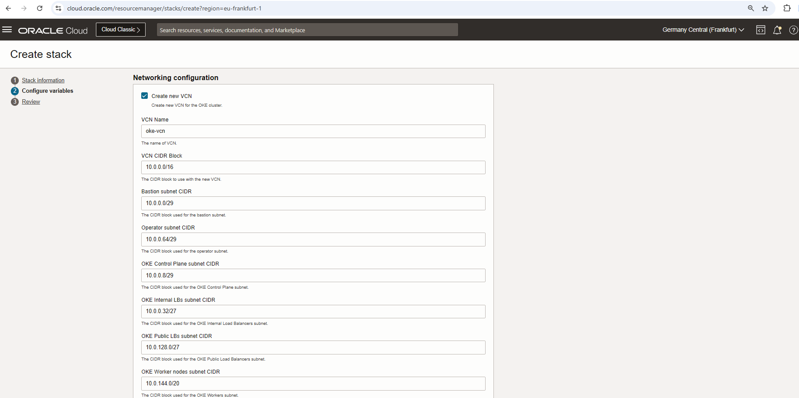
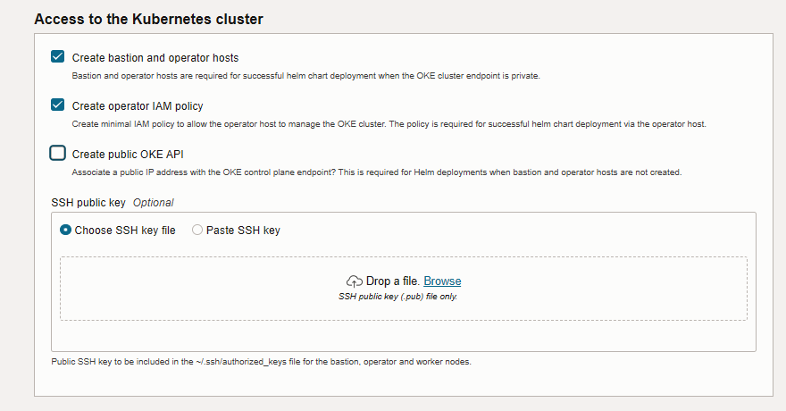
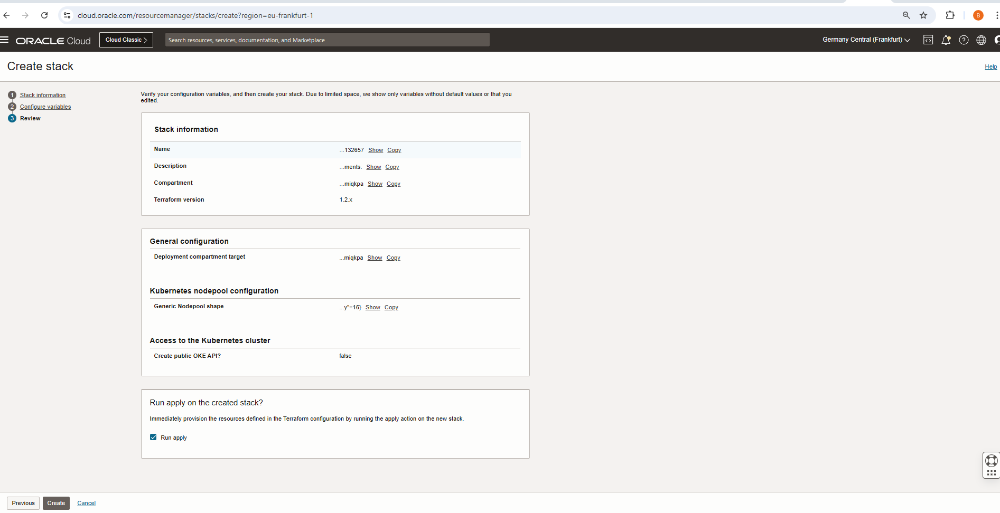

# Provision of resources to run different Llama3.2 models in OCI OKE

## Introduction

This lab will take you through the steps needed to provision the infrastructure using Resource manager and using OCI OKE.

Estimated Time: 30 minutes

### Objectives

Provisioning of infrastructure using Resource manager.

### Prerequisites

This lab assumes you have:

* An Oracle Cloud account
* Administrator permissions or permissions to use the OCI Compute and Identity Domains
* Access to A10 or GPU shape, Usage of the Terraform code for one click deployment.

## Task 1: Provision resources

1. Go to Resource manager -> Stacks -> Create Stack. Choose My configuration and upload the provided zip file and click Next: [orm_code_tritonllm_llama3.2_A10orm_code_tritonllm_llama3.2_oke-main.zip](https://github.com/bogdanbazarca/orm_code_tritonllm_llama3.2_A10orm_code_tritonllm_llama3.2_oke/archive/refs/heads/ocisa.zip)

    

    Or you could use a single click deployment button shown below

    [](https://cloud.oracle.com/resourcemanager/stacks/create?zipUrl=https://github.com/bogdanbazarca/orm_code_tritonllm_llama3.2_A10orm_code_tritonllm_llama3.2_oke/archive/refs/heads/ocisa.zip)

2. Select the options where you want to deploy:
    * a. **Compartment**, **Cluster Name [default is oke]**

    * b. **Create new VCN [If Needed, otherwise you can use an existing VCN] and customize the networking options**

    * c. **Kubernetes nodepool configuration (Generic Nodepool size, Generic Nodepool shape, Generic Nodepool boot volume size**
    * d. **GPU Nodepool size, GPU Nodepool shape (Default is A10), GPU Nodepool boot volume size (Default is 200GB))**

    * e. **Access to the Kubernetes cluster [Select if you want to Create bastion and operator hosts, Create operator IAM policy, Create public OKE API? and Provide SSH key]**


3. Select model engine based on the needed model version:
    * [engine-llama3.2-1b-full or engine-llama3.2-3b-full or engine-llama3.2-1b-instruct or engine-llama3.2-3b-instruct]


4. Click Next and then select Run Apply and finally click on Create as shown below.

    

5. Wait for the Job to succeed. It may take up 30 minutes for it to be successful and before infrastructure is provisioned.

## Task 2: Access the oke cluster via operator

1. Once the stack is created wait for it to complete and it will provide you with the details needed to access the oke cluster via operator and bastion host if you checked this option in Task 1 point 2.e

2. The stack will provide you at Ouput the following details:
   * a. `SELECTED_MODEL_ENGINE` [reconfirms the value selected an Task 1 point 3]
   * b. bastion [external IP address used for the created bastion host]
   * c. operator [private IP address of the operator host]
   * d. how to `ssh_to_operator` command to create the tunnel: "`ssh -o ProxyCommand='ssh -W %h:%p opc@<bastion_Public_IP>>' opc@<operator_Private_IP>`"

3. Copy the `ssh_to_operator` command and execute in Terminal.

4. Some commands to check the OKE status and configuration once connected to the operator:
    * ```k get all -A```: this allows you to review and confirm if the pod and the service are created, and to collect the values needed to test the model query.
    * You can test the model query with the following curl command: ```curl -X POST http://<External_LB_IP>:8000/v2/models/ensemble/generate -d '{"text_input": "What is machine learning?", "max_tokens": 20, "bad_words": "", "stop_words": ""}'```

## Acknowledgements

**Authors**

* **Bogdan Bazarca**, Senior Cloud Engineer, NACIE
