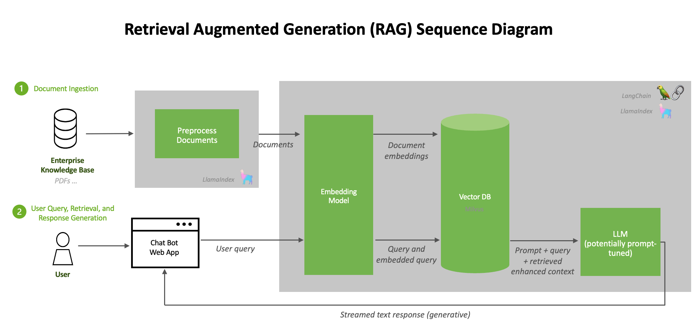

# Introduction

## About this Workshop

In the context of Large Language Models (LLMs), they generate responses based on publicly available data from the internet on which they are trained. However, if you need information that is proprietary and not publicly accessible, such as details from a specific document or file, the LLM cannot provide an accurate response based solely on its training data. To address this, an additional step is required: querying a vector database for the specific proprietary information. The LLM can then integrate this information with its broader knowledge to provide a relevant and accurate response. Please find RAG pipeline described in the image below. This entire application is deployed in OCI using Resource manager in this workshop.

Estimated Workshop Time: 3 hours

### Objectives

Objective of this workshop is to set-up a RAG application in OCI using Resource manager:

In this workshop, you will learn how to:

* Configure & set-up JupyterHub Notebook
* Run a RAG Chatbot application

### Prerequisites

This lab assumes you have:

* An Oracle Cloud account
* Administrator permissions or permissions to use the OCI tenancy
* Ability to spin-up A10 instances in OCI
* Ability to create resources with Public IP addresses (Load Balancer, Instances, OKE API Endpoint)
* Access to HuggingFace, accept selected HuggingFace model license agreement.

## Learn More

* [What Is RAG Pipeline?](https://developer.nvidia.com/blog/rag-101-demystifying-retrieval-augmented-generation-pipelines/)
* [What are Large Language Models?](https://www.nvidia.com/en-us/glossary/large-language-models/)
* [What are Vector Embeddings?](https://qdrant.tech/articles/what-are-embeddings/)

You may now proceed to the next lab.

## Acknowledgements

**Authors**

* **Andrei Ilas**, Master Principal Cloud Architect, NACIE
* **Abhinav Jain**, Senior Cloud Engineer, NACIE